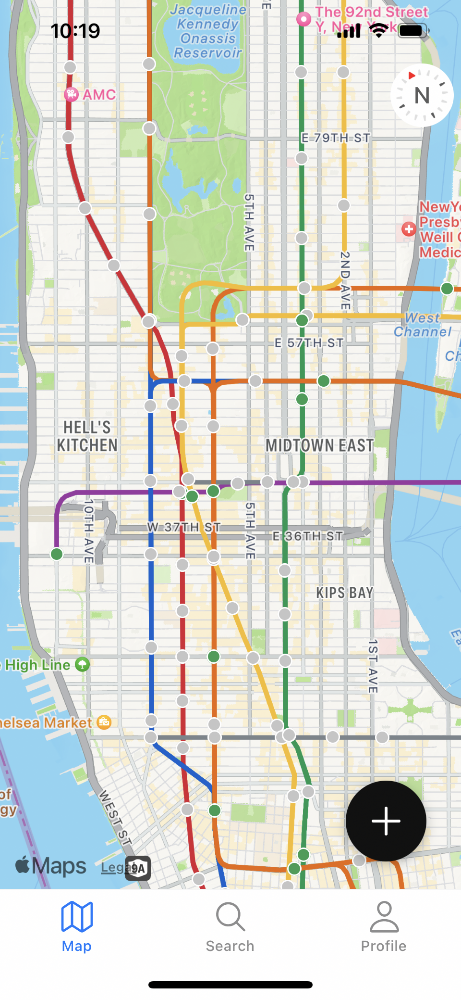
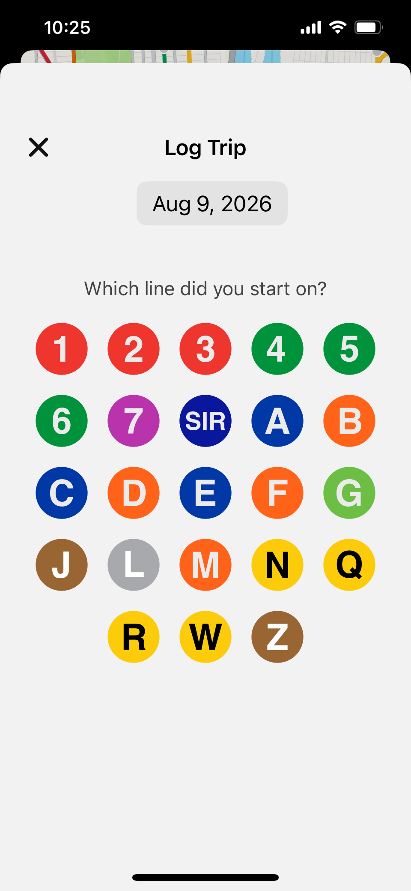
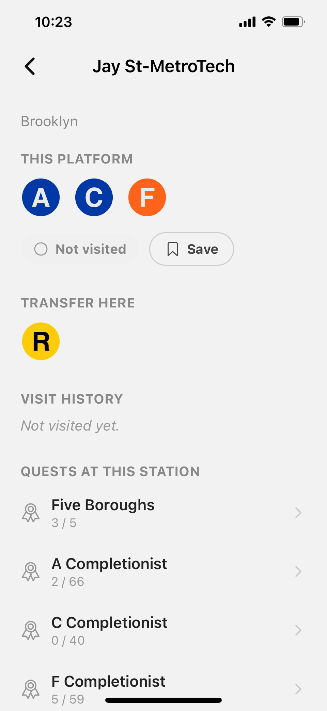
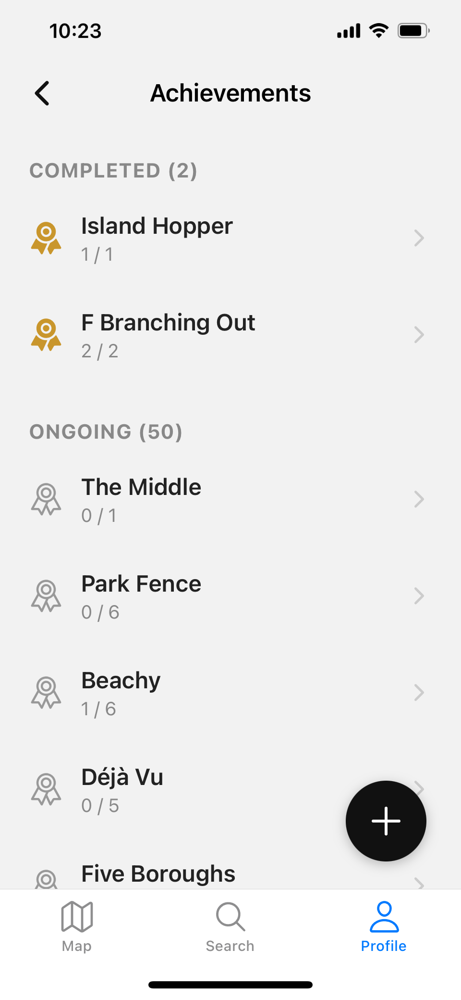
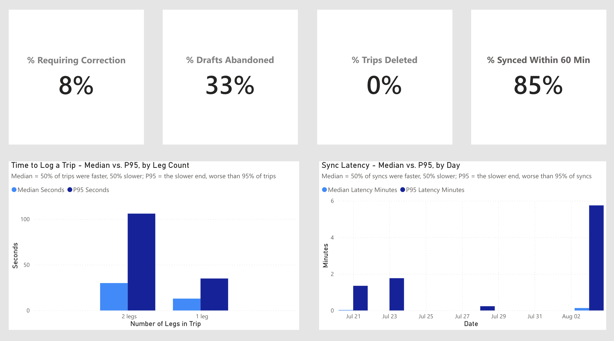

# SubwayQuest

A mobile app that logs your NYC subway rides and turns exploring the system into something visible and a little game-like — check off stations as you ride them and complete achievements for exploring new lines and neighborhoods, with your own progress tracked right in the app's Profile tab. A public dashboard aggregates activity across every rider for a system-wide view of how the app's being used.

Built end-to-end as a full data product: a React Native app generating real event data, a production-style pipeline transforming it, and a live BigQuery-connected Power BI dashboard on top — aimed at Data Analyst / Analytics Engineer / Data Engineer work, not just app development.

<p align="center">
  
  
  
  
</p>

## Live Dashboard

**[Dashboard Link](https://app.powerbi.com/view?r=eyJrIjoiZjc0ZDQ0YWQtOGE0NC00ZmY4LTg4YTQtMDVhMzdmNjhmMmZjIiwidCI6Ijg4ZTg3NDc5LTc2NDgtNGZhMS05NWUwLTUzZGZiM2EzYmVkOSIsImMiOjZ9)**

Four pages: Growth & Engagement, Product/Instrumentation, Exploration & Usage, Achievements. Refreshes automatically 4x/day off the same pipeline described below — not a one-time export.



## Engineering highlights

- **Event-sourced data model.** Every trip is a sequence of immutable events (`trip_started`, `leg_boarded`, `leg_alighted`, `trip_ended`); the app's local `trips`/`legs` tables and the warehouse's mart layer are both *projections* rebuilt from that log, not sources of truth themselves. Reconstructing entities from an event log in dbt — event-sourcing logic expressed in SQL, at warehouse scale — is real transformation work, not just schema conforming.
- **Disaster recovery.** If local data is ever lost (reinstall, new device, corruption), the app replays a user's full event history from Supabase back into local storage — one transaction, all-or-nothing, unit-tested and verified on-device.
- **Privacy-aware dashboard.** The public dashboard enforces minimum-N suppression (BigQuery row access policies, N=5) on every metric that names an actual place at small-group grain, verified against seeded boundary data at the exact threshold, not just eyeballed.
- **Offline-first.** Local-first writes with a transactional outbox sync — logging a trip works with zero connectivity, syncs when it returns.

## Architecture

```
Expo app (client)
  └── local SQLite: mutable trips/legs projection + immutable event log
        │  outbox sync, client-generated idempotency keys
        ▼
Supabase Postgres (raw_events — append-only, RLS-enforced)
        │  Python EL job, scheduled via GitHub Actions
        ▼
BigQuery (raw dataset)
        │  dbt: staging → intermediate → mart
        ▼
BigQuery (mart layer, min-N suppressed)
        │  native connector, scheduled auto-refresh
        ▼
Power BI → Publish to Web
```

**Client:** React Native (Expo), Apple Maps via `react-native-maps`, local-first SQLite
**Auth:** Supabase Auth, Sign in with Apple
**Warehouse:** BigQuery, transformed with dbt (staging → intermediate → mart)
**EL:** Python, scheduled via GitHub Actions (batch, watermark-based incremental load)
**BI:** Power BI, BigQuery's native connector for genuine free-tier auto-refresh

## By the numbers

- 496 stations, 445 transfer complexes, 83 real route branches across 29 routes — derived from raw MTA/GTFS data, verified against known geography
- 17 hand-authored + auto-generated achievements/quests across three completion mechanisms
- Full dbt staging → intermediate → mart chain, tested, verified against real BigQuery
- 81 unit tests across pure business-logic modules (quest evaluation, trip rehydration, station stats), runnable without a device

## What's built

- Trip logging — offline-first, atomic commit, full edit/correction flow
- Map, Station, Line, and Profile pages — visited/saved tracking, branch-aware line views, transfer awareness
- Achievements system — three completion mechanisms, full mobile UI, warehouse layer, dashboard page
- Full data pipeline, live and scheduled — Supabase → BigQuery → dbt → Power BI
- Privacy-enforced public dashboard, four pages, live auto-refresh

## What's not built yet

- UI polish (in progress)
- App Store release (in progress)
- Portfolio page write-up

## Repo structure

```
network/     GTFS processing, quest content, seed generation
mobile/      Expo app
supabase/    Postgres schema
el/          Python EL job (Supabase → BigQuery)
docs/        Architecture, data layer, UI spec — written before/alongside implementation, kept current
```

Fuller documentation — data layer design, UI spec, full build status — lives in `docs/` for anyone who wants to go deeper than this README.

## Author

**Van Brantley**

[LinkedIn](https://www.linkedin.com/in/vanbrantley/) · [Portfolio](https://www.vanbrantley.com)