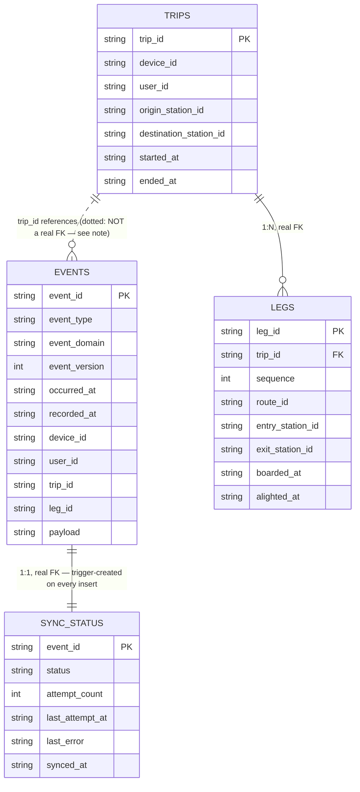
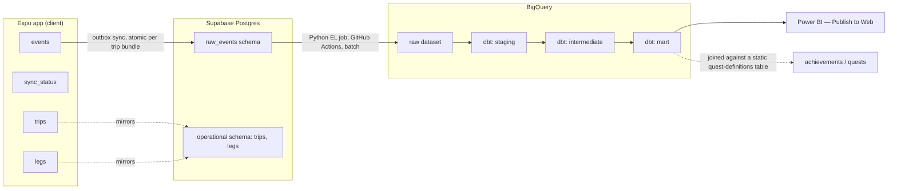

# SubwayQuest — Data Layer

Source of truth for the event log, the local/server schema, and the RLS design built on top of it.
Companion to `mobile/db/schema.sql` (local), `supabase/schema.sql` (server), and `mobile/db/projection.ts`.

## Envelope (every event row has these fields)

| field | type | notes |
|---|---|---|
| `event_id` | UUID (text) | Client-generated. Primary key and sync idempotency key — re-sending a pending outbox row is a no-op upsert, not a duplicate. |
| `event_type` | text | e.g. `leg_boarded`. |
| `event_domain` | text | `trip` \| `product`. |
| `event_version` | integer | Versions the payload shape per `event_type`. Starts at `1`. |
| `occurred_at` | ISO8601 | User-picked date (see "Date-only backdating") + actual current time-of-day at logging. |
| `recorded_at` | ISO8601 | Local device write time. |
| `device_id` | text | Client-generated, secondary — diagnostic/multi-device use only, not the security boundary. |
| `user_id` | UUID (text), NOT NULL | Real auth from day one — maps to Supabase `auth.users.id`. Known at write time since sign-in precedes any event. RLS keys on `auth.uid() = user_id` — a verified session identity, not a self-reported value, which is what makes this real row-level security rather than an organizational convention. |
| `trip_id` | UUID (text), nullable | Real column for `CHECK` enforcement + filtering. `NOT NULL` for trip-domain rows, `NULL` for product. Must be a collision-safe client-generated UUID — many independent users write into the same shared Supabase table. |
| `leg_id` | UUID (text), nullable | Same reasoning as `trip_id`. `NOT NULL` only for `leg_boarded`/`leg_alighted`. |
| `payload` | JSON (text/jsonb) | Everything else, per event type. `trip_id`/`leg_id` are pulled into real columns because they need enforcement/filtering; the rest varies too much per type to force into columns. |

Sync status (`pending`/`synced`) lives in a separate local-only `sync_status` table keyed by
`event_id` — operational metadata about the outbox, not a fact about the event itself.

This app is multi-user by design (TestFlight, then the App Store) — the shared Supabase/BigQuery
layers need real indexing on `user_id`/`trip_id` from day one, and every client-generated ID must be
collision-safe across independent phones, not just internally consistent on one device.

## Sync policy

**No conflict resolution exists, by design — not "last-write-wins," genuinely nothing to resolve:**
1. `events` is append-only and idempotent — `event_id` is identical across retries of the same
   logical action. `INSERT ... ON CONFLICT (event_id) DO NOTHING`.
2. Every `trip_id`/`leg_id` has exactly one legitimate writer, ever. No scenario produces two
   different writers proposing different values for the same row.

**Trip bundles sync atomically, one remote transaction per committed trip — not row-by-row.** A trip
commits locally as one atomic write; flushing it remotely one row at a time would risk the server
briefly holding a half-formed trip if the app died mid-flush. Product events carry no such guarantee
and sync one row at a time, any order.

## Commit model

Nothing is written to `event_domain = 'trip'` until "Log Trip" is tapped. Everything before that —
adding/removing draft legs, backing out — is `event_domain = 'product'` (see "Draft-session events"),
written incrementally in real time. At commit, the full bundle (`trip_started`, every leg's
`leg_boarded`/`leg_alighted`, `trip_ended`) writes together, atomically. A committed trip is never
half-formed.

**No edit mode.** A committed trip can't be partially corrected — only deleted (`trip_deleted`) and
re-logged. Logging takes ~20 seconds, so re-entry isn't meaningfully worse than a dedicated edit flow,
and it removes an entire category of cascading-consistency logic.

## Date-only backdating

The user picks a **date only** (default: today) — no time-of-day input anywhere. `occurred_at` =
picked date + actual current time-of-day at logging. All events in one atomic commit share a single
`occurred_at` — a leg's position is already captured by `sequence`, so a synthetic per-leg time would
imply false precision.

## Trip-grain events

| event_type | payload | grain |
|---|---|---|
| `trip_started` | `{ trip_id, origin_station_id }` | Once per trip, part of the commit bundle. |
| `trip_ended` | `{ trip_id, destination_station_id }` | Once per trip, part of the commit bundle. |
| `trip_deleted` | `{ trip_id, reason }` | The only post-commit domain event — full deletion, never partial correction. |

## Leg-grain events

| event_type | payload | grain |
|---|---|---|
| `leg_boarded` | `{ trip_id, leg_id, station_id, route_id }` | Once per leg, on boarding. |
| `leg_alighted` | `{ trip_id, leg_id, station_id }` | Once per leg, on alighting. |

**Transfers are not a separate event type.** A transfer is `leg_alighted` → `leg_boarded` at the same
`station_id`/`trip_id` with no `trip_ended` between — computed downstream (`stg_transfers` dbt
model), not stored, since the two leg events already carry every fact a `transfer_made` event would.

## Draft-session events (product domain)

| event_type | payload | grain |
|---|---|---|
| `trip_draft_started` | `{ draft_id }` | Screen opened. |
| `draft_leg_added` | `{ draft_id, sequence, route_id, entry_station_id }` | Once per leg added. |
| `draft_leg_removed` | `{ draft_id, sequence }` | Once per leg removed — the undo-count signal. |
| `trip_draft_committed` | `{ draft_id, trip_id }` | Fired alongside the trip-domain bundle at commit — bridges `draft_id` to `trip_id`. |
| `trip_draft_abandoned` | `{ draft_id }` | User backs out without committing. |

**Fixing an earlier leg mid-draft:** no in-place edit — tapping back to fix leg N removes every leg
from N onward (each firing `draft_leg_removed`), then the user re-enters from there. In-place editing
would need auto-recomputed downstream legs (a later leg's entry is the prior leg's exit) — pop-and-redo
avoids that cascading-consistency logic entirely. *(This is the same principle later generalized in
the mobile UI's chip-strip editor — see `docs/status.md`.)*

## Product events (app usage)

Deliberately minimal — extend as real usage questions come up, not ahead of the UI that would need them.

| event_type | payload | grain |
|---|---|---|
| `screen_viewed` | `{ screen_name, source_screen }` | Once per screen entry. |
| `station_detail_opened` | `{ station_id }` | Once per open. |
| `route_detail_opened` | `{ route_id }` | Once per open. |
| `feature_used` | `{ feature_name }` | Catch-all for taps not otherwise covered. |

## Naming convention

`snake_case`, `<subject>_<past-tense-verb>` for domain events, `<object>_<past-tense-verb>` for
product events. Always past tense — every row is a fact about something that already happened.

## Deliberate exclusions

- No `direction_id` stored anywhere — derivable from `entry_station_id`/`exit_station_id`'s relative
  order in `route_stops.json`. Same "don't store what's derivable" reasoning later applied to
  Supabase RLS on `legs` (below).
- No time-of-day input — only date-level backdating; batch logging never honestly has real per-leg
  times to offer.
- `station_id`/`route_id` are not validated against a reference table at the DB layer — static
  network data is bundled JSON, not loaded into SQLite. A malformed ID in a payload passes every
  constraint this schema has; stated as a known trust boundary, not an oversight.

## Local SQLite schema (ERD)



**Why `EVENTS`↔`TRIPS` is dotted, not solid:** `trips` is a projection *built from* `events`, not the
reverse — a `trip_started` event creates the concept of a trip; there's no `trips` row to reference at
the moment it's written. `trip_id` is `NOT NULL`/constrained, just not a formal FK. Same reasoning
applies to the omitted `EVENTS`↔`LEGS` line.

## Full pipeline (local → warehouse → dashboard)



`sync_status` never appears past the device — pure local outbox bookkeeping. Achievements/quests are
a downstream join against the mart, not a schema addition.

## Supabase RLS design

Every table in `operational` and `raw_events` enforces `auth.uid() = user_id`. The real design
question was **how `legs` gets checked**, since it only carries `trip_id`, not its own `user_id`.

**Rejected: denormalizing `user_id` onto `legs`.** Would give every table an identical flat policy,
but it's a second, write-only copy of a fact `trips.user_id` already holds, kept in sync for no
reason but its own policy's simplicity.

**Decided: derive it via a non-correlated `IN` subquery against `trips`, not a correlated `EXISTS`.**
The correlated form —
```sql
using (exists (select 1 from operational.trips where trips.trip_id = legs.trip_id and trips.user_id = auth.uid()))
```
— is a known Postgres/Supabase RLS anti-pattern: re-evaluated per row. The `IN` form Postgres can
plan once per statement:
```sql
using (trip_id in (select trip_id from operational.trips where user_id = (select auth.uid())))
```
Same normalized data, no per-row cost. `(select auth.uid())` (not bare `auth.uid()`) is used in every
policy for the same reason — Supabase's documented performance pattern, cached once per statement.

**`raw_events` needs the same shape on `WITH CHECK`, not just `USING`.** `events.user_id` is
client-set at insert; without `WITH CHECK (auth.uid() = user_id)`, RLS would only restrict reads —
this is the one place a policy gap would be a real cross-user data leak, not just an inconsistency.

**Append-only enforced by omitted grants, not just policy.** No `UPDATE`/`DELETE` grant exists on
`raw_events.events` for any role — stronger than an RLS policy, since a missing grant rejects the
operation before any row or policy is even considered.

## Data-layer rigor checklist

| # | item | status |
|---|---|---|
| 1 | Immutable, append-only event log | ✅ `events` |
| 2 | Client-generated idempotency keys | ✅ `event_id`, collision-safe UUIDs |
| 3 | Documented event schema per type | ✅ this doc |
| 4 | Real constraints at schema level | ✅ `schema_tests.py` — 29 checks |
| 5 | Explicitly designed edge cases | ✅ see above |
| 6 | Sync policy, stated | ✅ idempotent-insert / single-writer |
| 7 | dbt staging → intermediate → mart, tested | ⬜ not started |
| 8 | CI on every change | ⬜ not started |
| 9 | Data dictionary / ERD | ✅ this doc |
| 10 | Deliberate scope exclusions, stated | ✅ see above |
| 11 | Real RLS (not just organizational) | ✅ `supabase/schema.sql`, verified with two impersonated test users |