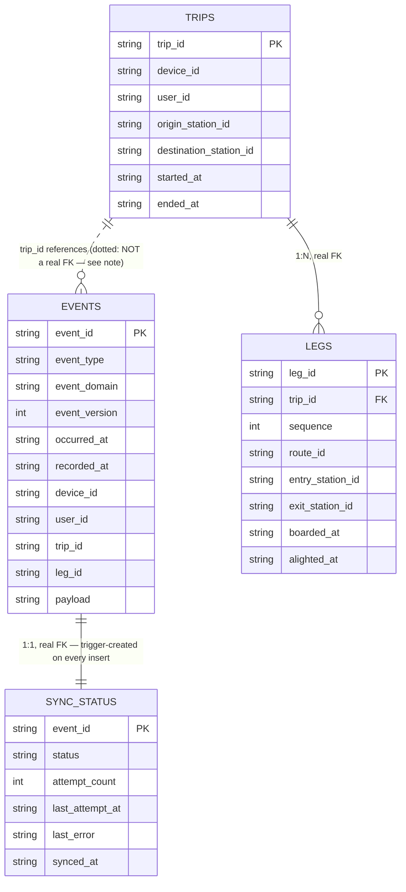
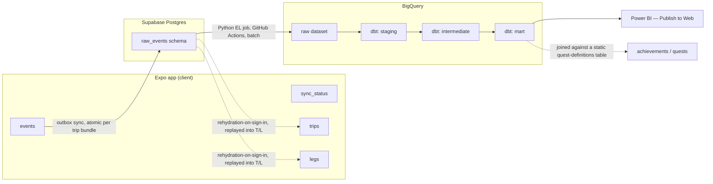

# SubwayQuest — Data Layer

Source of truth for the event log, the local/server schema, and the RLS design built on top of it.
Companion to `mobile/db/schema.sql` (local), `supabase/schema.sql` (server), and `mobile/db/projection.ts`.

## Envelope (every event row has these fields)

| field | type | notes |
|---|---|---|
| `event_id` | UUID (text) | Client-generated. Primary key and sync idempotency key — re-sending a pending outbox row is a no-op upsert, not a duplicate. |
| `event_type` | text | e.g. `leg_boarded`. |
| `event_domain` | text | `trip` \| `product`. |
| `event_version` | integer | Versions the payload shape per `event_type`. Starts at `1`. |
| `occurred_at` | ISO8601 | User-picked date (see "Date-only backdating") + actual current time-of-day at logging. |
| `recorded_at` | ISO8601 | Local device write time. |
| `loaded_at` | ISO8601 | Not part of the original event envelope — added at the BigQuery-landing layer. The EL job's own run timestamp (`sync_to_bigquery.py`'s execution time), distinct from `received_at` (when the row landed in Supabase). Kept separate so EL batch lag and sync-worker lag can be debugged independently. |
| `device_id` | text | Client-generated, secondary — diagnostic/multi-device use only, not the security boundary. |
| `user_id` | UUID (text), NOT NULL | Real auth from day one — maps to Supabase `auth.users.id`. Known at write time since sign-in precedes any event. RLS keys on `auth.uid() = user_id` — a verified session identity, not a self-reported value, which is what makes this real row-level security rather than an organizational convention. |
| `trip_id` | UUID (text), nullable | Real column for `CHECK` enforcement + filtering. `NOT NULL` for trip-domain rows, `NULL` for product. Must be a collision-safe client-generated UUID — many independent users write into the same shared Supabase table. |
| `leg_id` | UUID (text), nullable | Same reasoning as `trip_id`. `NOT NULL` only for `leg_boarded`/`leg_alighted`. |
| `payload` | JSON (text/jsonb) | Everything else, per event type. `trip_id`/`leg_id` are pulled into real columns because they need enforcement/filtering; the rest varies too much per type to force into columns. |

Sync status (`pending`/`synced`) lives in a separate local-only `sync_status` table keyed by
`event_id` — operational metadata about the outbox, not a fact about the event itself.

This app is multi-user by design (TestFlight, then the App Store) — the shared Supabase/BigQuery
layers need real indexing on `user_id`/`trip_id` from day one, and every client-generated ID must be
collision-safe across independent phones, not just internally consistent on one device.

## Sync policy

**No conflict resolution exists, by design — not "last-write-wins," genuinely nothing to resolve:**
1. `events` is append-only and idempotent — `event_id` is identical across retries of the same
   logical action. `INSERT ... ON CONFLICT (event_id) DO NOTHING`.
2. Every `trip_id`/`leg_id` has exactly one legitimate writer, ever. No scenario produces two
   different writers proposing different values for the same row.

**Trip bundles sync atomically, one remote transaction per committed trip — not row-by-row.** A trip
commits locally as one atomic write; flushing it remotely one row at a time would risk the server
briefly holding a half-formed trip if the app died mid-flush. Product events carry no such guarantee
and sync one row at a time, any order.

## Commit model

Nothing is written to `event_domain = 'trip'` until "Log Trip" is tapped. Everything before that —
adding/removing draft legs, backing out — is `event_domain = 'product'` (see "Draft-session events"),
written incrementally in real time. At commit, the full bundle (`trip_started`, every leg's
`leg_boarded`/`leg_alighted`, `trip_ended`) writes together, atomically. A committed trip is never
half-formed.

**No edit mode.** A committed trip can't be partially corrected — only deleted (`trip_deleted`) and
re-logged. Logging takes ~20 seconds, so re-entry isn't meaningfully worse than a dedicated edit flow,
and it removes an entire category of cascading-consistency logic.

## Date-only backdating

The user picks a **date only** (default: today) — no time-of-day input anywhere. `occurred_at` =
picked date + actual current time-of-day at logging. All events in one atomic commit share a single
`occurred_at` — a leg's position is already captured by `sequence`, so a synthetic per-leg time would
imply false precision.

## Trip-grain events

| event_type | payload | grain |
|---|---|---|
| `trip_started` | `{ trip_id, origin_station_id }` | Once per trip, part of the commit bundle. |
| `trip_ended` | `{ trip_id, destination_station_id }` | Once per trip, part of the commit bundle. |
| `trip_deleted` | `{ trip_id, reason }` | The only post-commit domain event — full deletion, never partial correction. |

## Leg-grain events

| event_type | payload | grain |
|---|---|---|
| `leg_boarded` | `{ trip_id, leg_id, station_id, route_id, sequence }` | Once per leg, on boarding. `sequence` added in `event_version: 2` — needed to reconstruct leg order during rehydration replay, not derivable from timestamps (see "Rehydration-on-sign-in"). |
| `leg_alighted` | `{ trip_id, leg_id, station_id }` | Once per leg, on alighting. Unchanged, `event_version: 1` — its leg is already identified via `leg_id`. |

**Transfers are not a separate event type.** A transfer is `leg_alighted` → `leg_boarded` at the same
`station_id`/`trip_id` with no `trip_ended` between — computed downstream (`stg_transfers` dbt
model), not stored, since the two leg events already carry every fact a `transfer_made` event would.

## Draft-session events (product domain)

| event_type | payload | grain |
|---|---|---|
| `trip_draft_started` | `{ draft_id }` | Screen opened. |
| `draft_leg_added` | `{ draft_id, sequence }` | Fires once per leg, only when that leg reaches completeness (`exitStationId` set) — not on every intermediate field pick. See `status.md`'s "Product-event instrumentation" for the full completeness rule and why. |
| `draft_leg_removed` | `{ draft_id, sequence }` | Fires once per *previously-complete* leg a cascade truncation discards — a leg still mid-pick (no exit yet) being cut is normal editing, not a correction, and fires nothing. The undo-count signal. |
| `trip_draft_committed` | `{ draft_id, trip_id }` | Fired alongside the trip-domain bundle at commit — bridges `draft_id` to `trip_id`. |
| `trip_draft_abandoned` | `{ draft_id }` | User backs out without committing. Fires unconditionally on discard, regardless of how much progress was made — see `status.md`'s bug-fix note on the draft-abandonment asymmetry this corrected. |

**Fixing an earlier leg mid-draft:** no in-place edit — tapping back to fix leg N removes every leg
from N onward (each firing `draft_leg_removed`, subject to the completeness rule above), then the
user re-enters from there. In-place editing would need auto-recomputed downstream legs (a later leg's
entry is the prior leg's exit) — pop-and-redo avoids that cascading-consistency logic entirely.
*(This is the same principle later generalized in the mobile UI's chip-strip editor — see
`docs/status.md`.)*

## Product events (app usage)

Deliberately minimal — extend as real usage questions come up, not ahead of the UI that would need them.

| event_type | payload | grain |
|---|---|---|
| `screen_viewed` | `{ screen_name, source_screen }` | Once per screen entry. |
| `station_detail_opened` | `{ station_id }` | Once per open. |
| `route_detail_opened` | `{ route_id }` | Once per open. |
| `feature_used` | `{ feature_name }` | Catch-all for taps not otherwise covered. |

## Naming convention

`snake_case`, `<subject>_<past-tense-verb>` for domain events, `<object>_<past-tense-verb>` for
product events. Always past tense — every row is a fact about something that already happened.

## Deliberate exclusions

- No `direction_id` stored anywhere — derivable from `entry_station_id`/`exit_station_id`'s relative
  order in `route_stops.json`. Same "don't store what's derivable" reasoning later applied to
  Supabase RLS on `legs` (below).
- No time-of-day input — only date-level backdating; batch logging never honestly has real per-leg
  times to offer.
- `station_id`/`route_id` are not validated against a reference table at the DB layer — static
  network data is bundled JSON, not loaded into SQLite. A malformed ID in a payload passes every
  constraint this schema has; stated as a known trust boundary, not an oversight.

## Local SQLite schema (ERD)



**Why `EVENTS`↔`TRIPS` is dotted, not solid:** `trips` is a projection *built from* `events`, not the
reverse — a `trip_started` event creates the concept of a trip; there's no `trips` row to reference at
the moment it's written. `trip_id` is `NOT NULL`/constrained, just not a formal FK. Same reasoning
applies to the omitted `EVENTS`↔`LEGS` line.

## Full pipeline (local → warehouse → dashboard)



`sync_status` never appears past the device — pure local outbox bookkeeping. Achievements/quests are
a downstream join against the mart, not a schema addition.

## Python EL job — Supabase to BigQuery

`el/sync_to_bigquery.py`, scheduled via GitHub Actions (`.github/workflows/pipeline.yml` — cron every 6
hours, plus manual `workflow_dispatch` for on-demand triggering, which is how it was tested this
session). Batch, not streaming — matches `PROJECT.md`'s stated architecture. **Same workflow file also
runs the dbt layer** (`dbt seed` → `dbt run` → `dbt test`) immediately after the EL job completes,
using the same GCP service-account credentials — one pipeline, EL and transform back to back, rather
than two separately-scheduled jobs that could drift out of sync with each other. A `dbt test` failure
fails the whole workflow run (no `continue-on-error`) — deliberate, matching this project's standing
preference for a loud, visible failure over data quietly reaching Power BI unverified.

**Incremental via watermark, not full reload.** Every run queries BigQuery for `MAX(received_at)`
already loaded, then pulls only newer rows from Supabase. No external state file — GitHub Actions
runners are stateless between runs, so the watermark is derived fresh from BigQuery itself each time,
not stored anywhere in between.

**Raw BigQuery table allows duplicates; dedup is deferred to dbt staging, not solved here.** A
`received_at >` watermark has a real edge case at the boundary — two rows sharing the exact same
`received_at` could mean `>` skips one, or `>=` reloads one twice. Rather than adding careful
boundary-handling logic to the EL job itself, the standard raw/staging pattern this project's already
committed to (staging → intermediate → mart) absorbs this: raw is an append-only capture layer
allowed to have occasional duplicate rows, and `stg_events.sql` (milestone 5) dedupes on `event_id`
via `QUALIFY ROW_NUMBER() OVER (PARTITION BY event_id ORDER BY received_at DESC) = 1`. This keeps the
EL job simple and idempotent-by-construction, instead of needing precise boundary logic that would
duplicate effort staging already has to do anyway.

**Requires elevated Supabase access, deliberately separate from the app's own credentials.** This job
reads every user's events, not one signed-in user's — RLS would silently filter it down to nothing
under a normal session. It authenticates using Supabase's `service_role` key ("secret key" in newer
Supabase UI wording), which bypasses RLS, and is granted read-only access (`select` only) on
`raw_events.events` — see "Supabase RLS design" below for the exact grant statements and reasoning.

**Secrets required (GitHub Actions repo secrets):** `SUPABASE_URL` (same value as the app's
`EXPO_PUBLIC_SUPABASE_URL`), `SUPABASE_SERVICE_ROLE_KEY` (Supabase's `service_role` key — never the
`anon`/publishable key the app uses, and never placed anywhere client-side), `GCP_PROJECT_ID`,
`GCP_SA_KEY` (GCP service account JSON, set up prior to this milestone).

**Operational gotcha worth remembering for any future schema change:** dropping a Postgres schema (as
happened when `operational` was removed) can wedge PostgREST's schema cache if that schema is still
listed under Supabase's Settings → API → Exposed Schemas — breaking *all* Data API queries, not just
ones against the dropped schema, with the error `PGRST002: Could not query the database for the
schema cache`. Fix is two-step: remove the dropped schema from Exposed Schemas, *then* reload
(`NOTIFY pgrst, 'reload schema';` alone is not sufficient if the cache rebuild attempt itself is
failing, which it will be while the dangling reference remains).

## Supabase RLS design

`raw_events.events` enforces `auth.uid() = user_id` directly — the table already carries `user_id`
as a real column, so no derived-ownership logic is needed (an earlier version of this design had a
harder version of this problem for `operational.legs`, which lacked its own `user_id` — see "Removed:
operational schema" below for why that problem no longer exists at all).

**`raw_events` needs the same shape on `WITH CHECK`, not just `USING`.** `events.user_id` is
client-set at insert; without `WITH CHECK (auth.uid() = user_id)`, RLS would only restrict reads —
this is the one place a policy gap would be a real cross-user data leak, not just an inconsistency.

**Append-only enforced by omitted grants, not just policy.** No `UPDATE`/`DELETE` grant exists on
`raw_events.events` for any role — stronger than an RLS policy, since a missing grant rejects the
operation before any row or policy is even considered.

**`service_role` needs its own explicit grants — RLS bypass and schema/table access are two
independent permission layers.** The Python EL job (see above) authenticates as `service_role` to
read across all users, which skips RLS policy checks entirely — but that alone doesn't grant it
access to the schema or table at all; Postgres rejects the query before RLS is even evaluated without
an explicit grant, same as any other role. Real statements run:
```sql
grant usage on schema raw_events to service_role;
grant select on raw_events.events to service_role;
```
Deliberately `select` only — this job reads from Supabase and writes to BigQuery, never the reverse,
so `service_role` gets no `insert`/`update`/`delete` here, matching the same least-privilege instinct
already applied to `authenticated`'s append-only-by-omitted-grants design above.

## Removed: `operational` schema (trips/legs mirror)

An earlier version of this design mirrored the local `trips`/`legs` projection into a Supabase
`operational` schema. In practice nothing was ever built to read from or write to it — the sync
worker only ever targeted `raw_events.events` — so it sat live, RLS-enforced, and completely empty.
That's a real violation of this project's own standing principle: a projection is derived and
rebuildable, never a second source of truth. An empty, unread mirror is worse than no mirror — it's
an ambiguous artifact a future reader has to spend time ruling out. Same instinct that already led to
removing `direction_id`, the retired `trip_auto_closed`/`trip_leg_undone` event types, and old status
columns. Dropped entirely — schema, tables, RLS policies, grants.

## Rehydration-on-sign-in (replaces `operational` for data continuity)

Deliberately framed broadly, not as "new phone." **Trigger condition:** local `trips` is empty, the
session is authenticated, and `raw_events` holds real history under that `user_id`. This is agnostic
to *why* local data is missing — genuine new device, reinstall, cleared app data, or local SQLite
corruption all produce the same state and get the same fix. Disaster recovery that happens to also
solve device-continuity, not a narrow "restore on new phone" feature.

**Mechanism:** on sign-in, if the trigger condition holds, fetch every `raw_events.events` row for
that `user_id`, group by `trip_id`, and replay each trip's events through the exact same
projection-writing logic `commitTrip` already uses for live commits (`writeProjectionRows`, factored
out for this reuse) — not a second, parallel implementation. A trip whose event group includes a
`trip_deleted` is skipped entirely, never materialized locally — matching exactly how a live delete
behaves. Since every trip's events are self-contained under one `trip_id`, replay processes
trip-by-trip, independent of any other trip.

**The whole replay is one local transaction, not one-transaction-per-trip.** Caught during
implementation: `needsRehydration`'s trigger check is "is local `trips` empty" — if replay wrote
some trips before crashing partway through, the next launch would see `trips` non-empty and skip
rehydration forever, permanently stranding the un-replayed remainder. Wrapping the entire multi-trip
replay in one transaction makes it genuinely all-or-nothing: a crash anywhere rolls the whole thing
back, `trips` stays empty, and the exact same trigger condition correctly re-fires next attempt.

**Required test, not an assumption:** confirm directly that a trip with a `trip_deleted` event never
materializes during replay — same standard already applied elsewhere in this project (see
`buildOccurredAt`'s timezone bug, caught by testing an assumption that looked correct on paper and
wasn't). The pure planning logic lives in `mobile/db/rehydrate-plan.ts` (deliberately zero React
Native/Expo/Supabase imports — importing `rehydrate.ts` directly for a test pulls in `expo-sqlite`,
which transitively pulls in Flow-syntax React Native source that a plain Node/tsx run can't parse;
splitting the pure decision logic out is what makes it testable outside the app runtime at all).
Required test written as `mobile/db/rehydrate_tests.ts`, same philosophy as `schema_tests.py`.
Verified both as a unit test (10/10 checks passing) and on-device (deleted and reinstalled the app,
confirmed all previously-synced trips restored correctly, including leg order).

**Real gap found while implementing this:** leg *order within a trip* is not recoverable from the
event log as originally specified. `leg_boarded`'s payload (`{ station_id, route_id }`) carries no
sequence, and every event in one committed trip's bundle shares the same `occurred_at`/`recorded_at`
(all written in the same local commit) — Postgres's `now()` is stable per-transaction, so
`received_at` can't break the tie either, since a multi-row bundle insert is one transaction. Nothing
in the original event shape lets a replay reconstruct which leg came first. **Fixed:** `leg_boarded`
now carries `sequence` in its payload — a real payload shape change, so `leg_boarded` moves to
`event_version: 2`. `leg_alighted` doesn't need it — its leg is already identified via `leg_id`,
matched back to the `leg_boarded` that established it. Pre-this-change test data lacks `sequence` and
will replay in arrival order if ever rehydrated — acceptable, since it only affects data already
covered by the existing dev/test launch-date-cutoff decision.

## Deleted trips at the dbt layer

Same exclusion problem `rehydrate-plan.ts`'s `planRehydration()` already solves locally — a `trip_deleted`
event doesn't remove the original trip's events from the append-only log, so anything reconstructing
trips from raw/staged events must explicitly exclude any `trip_id` whose event group includes a
`trip_deleted`. **Decided:** this exclusion happens once, in the intermediate layer's trip-reconstruction
model (`int_trips.sql`), as part of building the trip entity itself — not repeated as a `WHERE` clause
in every downstream mart query. Every mart model reads `int_trips`, not raw/staged events directly, and
gets correctness for free — same principle as local screens only ever reading `trips`/`legs`, never
`events` (see "Data-flow architecture").

**Exception, stated explicitly:** `dashboard-spec.md`'s "% of trips deleted after being logged" metric
is the one place that specifically *wants* to see `trip_deleted` events — it measures the deletion
behavior itself, so it reads staged events directly (or a dedicated deletion-tracking intermediate
model), not `int_trips`. Every other metric — exploration stats, growth counts, station/line
frequency — should be built on `int_trips` and never see a deleted trip's data at all.

**Required test:** same standard as rehydration's own — confirm directly, in a dbt test, that a trip
with a `trip_deleted` event never appears in `int_trips`. Don't assume the exclusion logic is correct
just because it mirrors already-tested local logic; SQL and TypeScript are different enough
implementations to warrant separately verifying the same invariant holds.

## Data-flow architecture — one projection per consumer, not one shared schema

Two fully independent read paths exist off the same event log, each purpose-built for what actually
reads it — this is a general principle worth stating explicitly, not just something that fell out of
removing `operational`:

**In-app (every screen — Map, Station, Line, Profile, Achievements):** reads local SQLite only — the
`trips`/`legs` projection built from local `events`, joined against bundled static JSON (stations,
routes, quest definitions — see "Quest-definitions, single source of truth" below). No screen ever
queries Supabase or BigQuery at request time. Single-user, always fresh, zero network dependency by
design — matches the offline-first requirement this whole local-first architecture exists for.

**Public dashboard:** `raw_events` (Supabase) → Python EL job → BigQuery raw dataset → dbt staging →
intermediate → mart → Power BI. Batch, cross-user, privacy-filtered (min-N suppression). Never reads
from or writes to the local SQLite projection at all — a completely separate consumer with completely
separate privacy/aggregation requirements from the in-app path.

**Rehydration-on-sign-in is the only bridge between the two, and it's one-directional and one-time per
trigger** — a disaster-recovery replay *from* `raw_events` *into* local SQLite, never the reverse, and
never an ongoing sync-back path. It exists to repopulate a projection that's supposed to always be
locally derivable, not to keep two schemas in permanent agreement.

**This is why `operational` was redundant, stated as a principle rather than just a bug fix:** a third
schema mirroring the same `trips`/`legs` shape server-side would have been a shared schema serving two
different consumers with two different requirements (single-user/always-fresh vs. cross-user/batch/
privacy-filtered) — exactly the setup that made it unclear whether it was safe to treat as a live
source or notice it was silently unpopulated. Two independent, purpose-built projections — one local,
one in BigQuery's mart — each derived fresh from the same append-only event log, is the design this
project actually wants: derived and rebuildable everywhere, never a second source of truth anywhere.

## dbt transformation layer: staging → intermediate → mart

Even with a single clean source (unlike the NYC Data Job Market Tracker's three heterogeneous
sources), this project still needs the full staging → intermediate → mart shape — because the raw
data has a grain problem, not a source-consistency problem. `raw_events.events` is an event log: one
row per `trip_started`, one per `leg_boarded`, one per `leg_alighted`, scattered many-rows-per-trip,
with a `payload` shape that depends on `event_type`. Almost nothing `dashboard-spec.md` asks for wants
to query at that grain — "% of system explored" wants one row per trip or per user; nothing downstream
wants to reconstruct "what actually happened" from six raw rows on every query. That reconstruction —
event log → entity — is real transformation work on its own, structurally the same problem the local
SQLite projection (`trips`/`legs` built from `events`) already solves, just in SQL, across every
user's history at once instead of one device's.

**Staging (`stg_events.sql`) — tames the raw rows, doesn't change their grain:**
- Dedups on `event_id` (the EL job deliberately allows duplicates at the `received_at` watermark
  boundary — this is where that gets resolved, via `QUALIFY ROW_NUMBER()`, per "Python EL job" above)
- Parses `payload`'s JSON into typed fields
- Handles `leg_boarded`'s two live payload versions (`sequence` present or not, per `event_version`)
- Applies the dev/test launch-date cutoff, once picked (see `status.md`'s "Dev/test data exclusion")

**Intermediate — the layer that wouldn't exist if the data were already entity-shaped. Real
grain change plus real business logic, not cleanup:**
- `int_trips` — reconstructs trips/legs from scattered `trip_started`/`leg_boarded`/`leg_alighted`/
  `trip_ended` rows: event-sourcing logic, in SQL, at warehouse scale. Excludes any `trip_id` whose
  event group includes a `trip_deleted` — see "Deleted trips at the dbt layer" below for the full
  reasoning and the required test. Every mart model reads `int_trips`, never raw/staged events
  directly, and gets that exclusion for free.
- Transfer detection — `leg_alighted` → `leg_boarded`, same `station_id`/`trip_id`, no `trip_ended`
  between. A derived business rule, never stored, per "Leg-grain events" above.
- `int_draft_sessions` — one row per `draft_id`, only for drafts with a matching
  `trip_draft_committed` (an abandoned draft has no such row, so it drops out of this model by the
  join itself, not a filter). `duration = committed_at − started_at`
  (`trip_draft_committed.recorded_at − trip_draft_started.recorded_at`). Leg count comes from an
  **inner join to `int_trips`** on `trip_id` — deliberately, not staged events directly. A trip later
  deleted almost always means the person was testing the app or logged something they knew wasn't
  real, not a genuine ride — exactly the kind of noise a "how long does real logging take" metric
  shouldn't include. So a draft whose committed trip was later deleted produces no row here at all,
  the same exclusion `int_trips` already gives every other metric, just recognized as correct for
  this one too rather than assumed. Required test: `unique` on `draft_id` for both
  `trip_draft_started` and `trip_draft_committed` — catches a double-fire (e.g. a remount bug)
  loudly rather than silently averaging over it with `MIN(recorded_at)`.

**Exception, stated explicitly so it doesn't get "fixed" later:** `dashboard-spec.md`'s "% of trips
deleted after being logged" is the one metric that specifically *wants* to see `trip_deleted` events
— it measures the deletion behavior itself. It reads staged events directly (or a small dedicated
intermediate model built just for it), never `int_trips`. Every other metric — exploration,
growth, `int_draft_sessions` included — should never see a deleted trip's data at all.

**Mart** — reshapes `int_trips`/`int_draft_sessions`/transfers into the three page-shaped outputs
`dashboard-spec.md` defines (Exploration, Growth & Behavior, Product/Instrumentation), with
`segment_user_count` precomputed on any segment-level metric for the min-N row access policy to key
off later (see "Privacy: minimum-N suppression" in `dashboard-spec.md`). This layer actually is
aggregation, not derivation — the real logic already happened one layer up.

**Materialization: staging = view, intermediate = view, mart = table.** Different reasoning than the
NYC project's Snowflake setup, same three-tier shape. A BigQuery view costs nothing to store — it's
billed only when queried, unlike Snowflake's storage model. That makes an intermediate *view* cost
nothing over making it ephemeral, while buying something real: `int_trips`/`int_draft_sessions` stay
directly queryable and hand-checkable in the console, matching this project's standing practice of
verifying a real number at every milestone (see the build sequence table in `status.md`) rather than
trusting a chain of inlined CTEs no object exists to inspect. Mart is a table because that's the one
tier that should cost storage: Power BI's scheduled refresh should hit precomputed data, not
recompute the full chain live, and the min-N row access policy needs a real table to attach to.

**Note on why this transformation layer feels heavier than the NYC Data Job Market Tracker's:**
Worth naming explicitly, since the difference isn't obvious in the moment and is easy to mistake for
"this project is just more complex" rather than understanding *why*. Three separate, stacking reasons:

1. **Raw grain.** The NYC tracker's sources were already entity-grain — heterogeneous *schemas*
   needing conforming, but each row was already "one job posting." SubwayQuest's raw data is an
   event log by design — many rows per trip, many rows per draft session. Getting to "one row per
   trip" isn't cleaning, it's reconstruction — genuinely more transformation work, independent of
   the dashboard tool.
2. **Where aggregation happens.** The NYC tracker's dashboard was Streamlit — live Python,
   recomputing on every page load, so its mart could stay a thin `select * from int_jobs` and let
   the dashboard do the real aggregation work at request time. Power BI's free-tier "Publish to
   Web" is scheduled batch refresh with no live compute layer in between — aggregation has to
   already be sitting in the table it reads, precomputed, or it doesn't happen at all. Not "dbt is
   more powerful here" — there's no other place left for that work to live.
3. **Privacy-forced precomputation, specific to this project.** `segment_user_count` isn't just a
   nice-to-have aggregate — the min-N row access policy genuinely requires it to exist as a real
   materialized column to filter on. The NYC tracker had no analogous mechanism forcing aggregation
   into dbt.

## Quest-definitions, single source of truth

Achievements has two consumers with different requirements: the in-app screen (join quest definitions
against local trip history, per-device) and the BigQuery mart's "% of users completing each quest"
stat (`dashboard-spec.md`, cross-user aggregate). **Decided: `network/processed/quests.json` is
canonical — same pipeline/bundling pattern as `stations.json`/`route_stops.json`/`transfers.json`.**
The in-app Achievements screen imports it directly, same mechanism `subwayData.ts` already uses for
the others.

The dbt/BigQuery side does not get an independently-authored copy. dbt seeds are CSV, not JSON, so
this isn't a direct reuse — but generating one from the other is a fundamentally different
relationship than authoring two copies by hand, which is the actual failure mode being avoided (see
"Data-flow architecture" above, and the precedent already set by `direction_id`, the rejected
denormalized-`user_id`-on-`legs` design, and `operational` itself). A `network/scripts/
build_quest_seed.py` step (parallel to `build_static_data.py`) reads `quests.json` and writes `dbt/
seeds/quest_definitions.csv` — a generated build artifact, never hand-edited, same relationship
`mobile/data/`'s bundled JSON already has to `network/processed/`'s tracked source. Run manually
whenever quest content changes, same pattern already established for `mobile/scripts/sync-data.js`.

## Data-layer rigor checklist

| # | item | status |
|---|---|---|
| 1 | Immutable, append-only event log | ✅ `events` |
| 2 | Client-generated idempotency keys | ✅ `event_id`, collision-safe UUIDs |
| 3 | Documented event schema per type | ✅ this doc |
| 4 | Real constraints at schema level | ✅ `schema_tests.py` — 29 checks |
| 5 | Explicitly designed edge cases | ✅ see above |
| 6 | Sync policy, stated | ✅ idempotent-insert / single-writer, verified on-device |
| 7 | dbt staging → intermediate → mart, tested | ⬜ not started |
| 8 | CI on every change | ⬜ not started |
| 9 | Data dictionary / ERD | ✅ this doc |
| 10 | Deliberate scope exclusions, stated | ✅ see above |
| 11 | Real RLS (not just organizational) | ✅ `supabase/schema.sql`, verified with two impersonated test users |
| 12 | Batch EL job, real data verified in warehouse | ✅ `el/sync_to_bigquery.py`, manually triggered, output verified against BigQuery directly |
| 13 | Disaster-recovery path for local data loss | ✅ rehydration-on-sign-in, unit-tested and on-device verified |