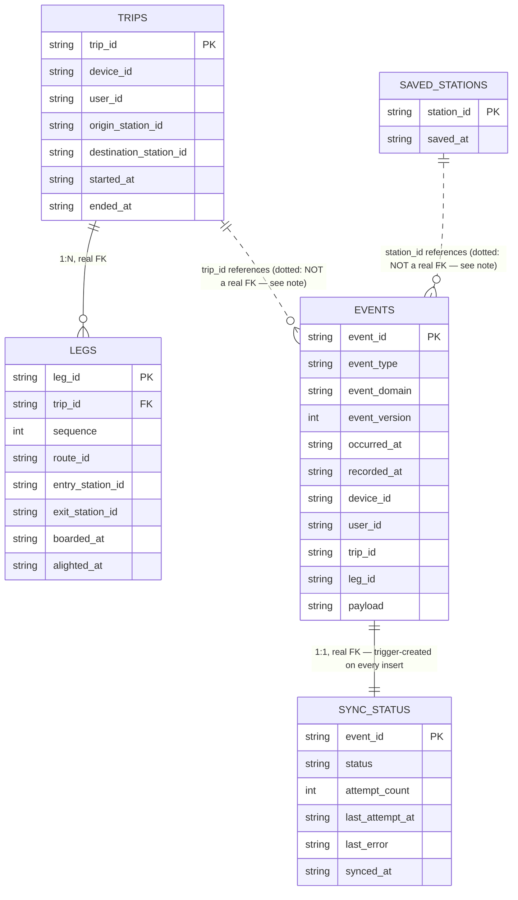
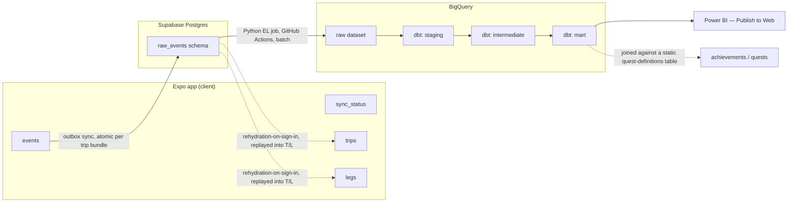

# SubwayQuest — Data Layer

Source of truth for the event log, the local/server schema, and the RLS design built on top of it.
Companion to `mobile/db/schema.sql` (local), `supabase/schema.sql` (server), and `mobile/db/projection.ts`.

## Envelope (every event row has these fields)

| field | type | notes |
|---|---|---|
| `event_id` | UUID (text) | Client-generated. Primary key and sync idempotency key — re-sending a pending outbox row is a no-op upsert, not a duplicate. |
| `event_type` | text | e.g. `leg_boarded`. |
| `event_domain` | text | `trip` \| `product`. |
| `event_version` | integer | Versions the payload shape per `event_type`. Starts at `1`. |
| `occurred_at` | ISO8601 | User-picked date (see "Date-only backdating") + actual current time-of-day at logging. |
| `recorded_at` | ISO8601 | Local device write time. |
| `loaded_at` | ISO8601 | Not part of the original event envelope — added at the BigQuery-landing layer. The EL job's own run timestamp (`sync_to_bigquery.py`'s execution time), distinct from `received_at` (when the row landed in Supabase). Kept separate so EL batch lag and sync-worker lag can be debugged independently. |
| `device_id` | text | Client-generated, secondary — diagnostic/multi-device use only, not the security boundary. |
| `user_id` | UUID (text), NOT NULL | Real auth from day one — maps to Supabase `auth.users.id`. Known at write time since sign-in precedes any event. RLS keys on `auth.uid() = user_id` — a verified session identity, not a self-reported value, which is what makes this real row-level security rather than an organizational convention. |
| `trip_id` | UUID (text), nullable | Real column for `CHECK` enforcement + filtering. `NOT NULL` for trip-domain rows, `NULL` for product. Must be a collision-safe client-generated UUID — many independent users write into the same shared Supabase table. |
| `leg_id` | UUID (text), nullable | Same reasoning as `trip_id`. `NOT NULL` only for `leg_boarded`/`leg_alighted`. |
| `payload` | JSON (text/jsonb) | Everything else, per event type. `trip_id`/`leg_id` are pulled into real columns because they need enforcement/filtering; the rest varies too much per type to force into columns. |
| `is_test` | boolean, NOT NULL, default `false` | Set at write time from the build's `IS_DEV_MODE` — see "Dev/prod data separation" below. |

Sync status (`pending`/`synced`) lives in a separate local-only `sync_status` table keyed by
`event_id` — operational metadata about the outbox, not a fact about the event itself.

This app is multi-user by design (TestFlight, then the App Store) — the shared Supabase/BigQuery
layers need real indexing on `user_id`/`trip_id` from day one, and every client-generated ID must be
collision-safe across independent phones, not just internally consistent on one device.

## Dev/prod data separation

Dev/testing signs in with the same Apple ID (same Supabase `user_id`) that's used for real
post-launch usage — so `user_id` can't separate test rows from real ones, and neither can a date
cutoff, since ongoing dev testing continues right through and past any chosen launch date. (An
earlier design tried exactly the date-cutoff approach — `stg_events.sql` filtering
`occurred_at >= <launch date>` — before this was built; see git history / `docs/status.md` if that
reasoning is ever needed. It didn't survive contact with "I need to keep testing on the same account
after real usage starts.")

**`IS_DEV_MODE`** (`mobile/lib/devMode.ts`) is the single source of truth:
```ts
export const IS_DEV_MODE = process.env.EXPO_PUBLIC_DEV_MODE === 'true';
```
Every other file reads `IS_DEV_MODE` from here — nothing else reads `process.env.EXPO_PUBLIC_DEV_MODE`
directly. It's a **build-time** flag, not a runtime toggle:
- Locally, `mobile/.env` sets `EXPO_PUBLIC_DEV_MODE=true` (gitignored, never committed — every
  developer/tester sets their own).
- Per EAS build, `eas.json`'s `env` block sets it per profile: `development`/`preview` → `"true"`,
  `production` → `"false"`. This is baked into the JS bundle at build time by Expo's env-var
  handling — a production build cannot accidentally run with dev mode on; there is no code path that
  flips it after the bundle is built.

**Write path:** `mobile/db/projection.ts`'s `insertEvent()` is the one place every locally-created
event (trip domain and product domain alike — `station_saved`/`station_unsaved` go through the exact
same function) gets written, and it sets `is_test = IS_DEV_MODE` unconditionally. No other call site
needs to pass anything.

**Read path, two layers:**
1. **Local SQLite** — `trips` and `saved_stations` both carry `is_test` (copied from the event that
   created/last-touched them). `mobile/db/testDataFilter.ts`'s `testDataFilterSql()` is the one shared
   SQL fragment every query joining to either table uses — a dev-mode build adds no filter (sees
   everything); a production build appends `AND is_test = 0`. Deliberately NOT applied to the dev-only
   raw-dump debug screen (`mobile/app/debug.tsx`), whose whole purpose is showing unfiltered ground
   truth, or to `needsRehydration`'s existence check (see below).
2. **Rehydration** (`mobile/db/rehydrate.ts`) — the mechanism that actually keeps a production
   install from ever pulling a dev-mode tester's fake data down from the *same* Supabase account in
   the first place. `rehydrateFromRemote`'s two Supabase queries add `.eq('is_test', false)` when
   `!IS_DEV_MODE`; a dev-mode build fetches everything. Each restored trip/saved-station keeps
   whichever `is_test` value it was originally written with (not the current build's `IS_DEV_MODE`) —
   a dev-mode rehydrate can restore a mix of real and test rows from earlier sessions.

**Warehouse:** `raw_events.events` (Supabase) and `subwayquest_raw.events` (BigQuery, via
`el/sync_to_bigquery.py`'s explicit schema) both carry `is_test`. `stg_events.sql` filters
`where is_test = false` and does not carry the column into its own output (every row downstream is
already guaranteed `false` by that filter, so exposing a column that can only ever hold one value
would be redundant) — every mart/intermediate model downstream is automatically test-data-free for
free, with no per-model filtering needed.

## Sync policy

**No conflict resolution exists, by design — not "last-write-wins," genuinely nothing to resolve:**
1. `events` is append-only and idempotent — `event_id` is identical across retries of the same
   logical action. `INSERT ... ON CONFLICT (event_id) DO NOTHING`.
2. Every `trip_id`/`leg_id` has exactly one legitimate writer, ever. No scenario produces two
   different writers proposing different values for the same row.

**Trip bundles sync atomically, one remote transaction per committed trip — not row-by-row.** A trip
commits locally as one atomic write; flushing it remotely one row at a time would risk the server
briefly holding a half-formed trip if the app died mid-flush. Product events carry no such guarantee
and sync one row at a time, any order.

## Commit model

Nothing is written to `event_domain = 'trip'` until "Log Trip" is tapped. Everything before that —
adding/removing draft legs, backing out — is `event_domain = 'product'` (see "Draft-session events"),
written incrementally in real time. At commit, the full bundle (`trip_started`, every leg's
`leg_boarded`/`leg_alighted`, `trip_ended`) writes together, atomically. A committed trip is never
half-formed.

**No edit mode.** A committed trip can't be partially corrected — only deleted (`trip_deleted`) and
re-logged. Logging takes ~20 seconds, so re-entry isn't meaningfully worse than a dedicated edit flow,
and it removes an entire category of cascading-consistency logic.

## Date-only backdating

The user picks a **date only** (default: today) — no time-of-day input anywhere. `occurred_at` =
picked date + actual current time-of-day at logging. All events in one atomic commit share a single
`occurred_at` — a leg's position is already captured by `sequence`, so a synthetic per-leg time would
imply false precision.

## Trip-grain events

| event_type | payload | grain |
|---|---|---|
| `trip_started` | `{ trip_id, origin_station_id }` | Once per trip, part of the commit bundle. |
| `trip_ended` | `{ trip_id, destination_station_id }` | Once per trip, part of the commit bundle. |
| `trip_deleted` | `{ trip_id, reason }` | The only post-commit domain event — full deletion, never partial correction. |

## Leg-grain events

| event_type | payload | grain |
|---|---|---|
| `leg_boarded` | `{ trip_id, leg_id, station_id, route_id, sequence }` | Once per leg, on boarding. `sequence` added in `event_version: 2` — needed to reconstruct leg order during rehydration replay, not derivable from timestamps (see "Rehydration-on-sign-in"). |
| `leg_alighted` | `{ trip_id, leg_id, station_id }` | Once per leg, on alighting. Unchanged, `event_version: 1` — its leg is already identified via `leg_id`. |

**Transfers are not a separate event type.** A transfer is every `leg_alighted` → `leg_boarded` pair
within the same `trip_id` after the first leg — computed downstream (`int_transfers` dbt model), not
stored, since the two leg events already carry every fact a `transfer_made` event would.

**Not matched on `station_id`.** An earlier version of this definition required the prior leg's exit
`station_id` to equal the next leg's entry `station_id` ("same station, no `trip_ended` between"). That
undercounted real transfers: per `ui-spec.md`'s trip-logging spec, a transfer leg's entry is auto-set
to "the correct platform at that complex," which is frequently a *different* `station_id` than the
prior leg's exit — e.g. Union Sq (complex 602, see the grain note above): exiting the 6 at station_id
`635`, entering the L at station_id `L03`. Same real-world complex, different platforms, both real, and
the old exact-match logic silently missed it. 35 complexes system-wide have 2+ distinct station_ids,
disproportionately the busy hub stations where transfers actually happen most.

No station/complex matching is needed at all, instead: the trip-logging flow's transfer step only ever
offers routes other than the one just ridden (`ui-spec.md`'s "Transfer detection" step), so every leg
after a trip's first is a real transfer **by construction**, guaranteed at commit time. `trip_ended`
firing once per commit bundle, after every leg, is what makes "no `trip_ended` between" automatic —
any two legs sharing a `trip_id` are already structurally before it.

## Draft-session events (product domain)

| event_type | payload | grain |
|---|---|---|
| `trip_draft_started` | `{ draft_id }` | Screen opened. |
| `draft_leg_added` | `{ draft_id, sequence }` | Fires once per leg, only when that leg reaches completeness (`exitStationId` set) — not on every intermediate field pick. See `status.md`'s "Product-event instrumentation" for the full completeness rule and why. |
| `draft_leg_removed` | `{ draft_id, sequence }` | Fires once per *previously-complete* leg a cascade truncation discards — a leg still mid-pick (no exit yet) being cut is normal editing, not a correction, and fires nothing. The undo-count signal. |
| `trip_draft_committed` | `{ draft_id, trip_id }` | Fired alongside the trip-domain bundle at commit — bridges `draft_id` to `trip_id`. |
| `trip_draft_abandoned` | `{ draft_id }` | User backs out without committing. Fires unconditionally on discard, regardless of how much progress was made — see `status.md`'s bug-fix note on the draft-abandonment asymmetry this corrected. |

**Fixing an earlier leg mid-draft:** no in-place edit — tapping back to fix leg N removes every leg
from N onward (each firing `draft_leg_removed`, subject to the completeness rule above), then the
user re-enters from there. In-place editing would need auto-recomputed downstream legs (a later leg's
entry is the prior leg's exit) — pop-and-redo avoids that cascading-consistency logic entirely.
*(This is the same principle later generalized in the mobile UI's chip-strip editor — see
`docs/status.md`.)*

## Station-save events (product domain, milestone 9)

| event_type | payload | grain |
|---|---|---|
| `station_saved` | `{ station_id }` | User taps Save on a station (Map preview or Station page). |
| `station_unsaved` | `{ station_id }` | User taps Unsave. No auto-unsave anywhere — visiting a saved station does not remove it from the saved list (see `ui-spec.md`'s Profile tab spec); only this explicit action does. |

**Grain is `station_id` — the GTFS stop_id already used in `leg_boarded`'s payload and
`legs.entry_station_id`/`exit_station_id` — deliberately NOT `complex_id`.** A complex bundles
physically separate platforms (e.g. Union Sq's 4/5/6, N/Q/R/W, and L platforms are one complex but
three distinct physical places) — complex-grain would make saving one marker light up unrelated
markers sharing that complex. Quest completion stays complex-grain on purpose (a quest like "visit
Union Square" is about the place, not the platform). Two intentionally different grains for two
different concerns, not an inconsistency: "visited" status (map markers, Profile stats) is also
stop_id-grain, for free, since it's derived directly from `legs.entry_station_id`/`exit_station_id` —
so saved-grain and visited-grain already agree, and only quest-grain deliberately differs.

*(Separately, whether a Station/Line page's UI shows a stop's own lines only, or also lines reachable
via transfer at the same complex, is a **display-only** choice layered on top of this grain decision,
not a data-layer concern — see `ui-spec.md`'s Canonical Station/Line page sections. Changing that
display choice later never requires touching this grain or `stations.ts`/`stations_logic.ts`.)*

**Local projection:** `saved_stations (station_id TEXT PRIMARY KEY, saved_at TEXT)` — a projection off
this event pair, same relationship to `events` as `trips`/`legs`: derived and rebuildable, never a
second source of truth (see the ERD below). No `user_id` column — same reasoning as not indexing
`events.device_id` locally: this local database only ever holds one account's own rows.

**Rehydration covers this too, inside the same transaction as trip replay** — `mobile/db/rehydrate_logic.ts`'s
`planSavedStations()` folds a user's `station_saved`/`station_unsaved` history into a final saved-set
(last-write-wins per `station_id`, ordered by `recorded_at`), and `rehydrate.ts` writes the result into
`saved_stations` inside the same `withTransactionAsync` block that already replays trips — preserving
the existing all-or-nothing crash guarantee for both concerns at once. Same single trigger
(`needsRehydration`: local `trips` empty) covers both; no second trigger was added for a
corrupted-saved-stations-only edge case.

**No EL/dbt changes needed** — the EL job pulls all of `raw_events.events` regardless of type, so these
land in BigQuery's raw dataset for free; nothing downstream reads them yet.

**Supabase's live `raw_events.events` CHECK constraint needed a manual migration**, not just a
`schema.sql` source edit — the table already exists in production (see status.md, milestone 1). See
`supabase/schema.sql`'s comment on this for the exact statements run.

## Product events (app usage)

Deliberately minimal — extend as real usage questions come up, not ahead of the UI that would need them.

| event_type | payload | grain |
|---|---|---|
| `screen_viewed` | `{ screen_name, source_screen }` | Once per screen entry. |
| `station_detail_opened` | `{ station_id }` | Once per open. |
| `route_detail_opened` | `{ route_id }` | Once per open. |
| `feature_used` | `{ feature_name }` | Catch-all for taps not otherwise covered. |

## Naming convention

`snake_case`, `<subject>_<past-tense-verb>` for domain events, `<object>_<past-tense-verb>` for
product events. Always past tense — every row is a fact about something that already happened.

## Deliberate exclusions

- No `direction_id` stored anywhere — derivable from `entry_station_id`/`exit_station_id`'s relative
  order in `route_stops.json`. Same "don't store what's derivable" reasoning later applied to
  Supabase RLS on `legs` (below).
- No time-of-day input — only date-level backdating; batch logging never honestly has real per-leg
  times to offer.
- `station_id`/`route_id` are not validated against a reference table at the DB layer — static
  network data is bundled JSON, not loaded into SQLite. A malformed ID in a payload passes every
  constraint this schema has; stated as a known trust boundary, not an oversight.

## Local SQLite schema (ERD)


```mermaid
erDiagram
    EVENTS {
        string event_id PK
        string event_type
        string event_domain
        int event_version
        string occurred_at
        string recorded_at
        string device_id
        string user_id
        string trip_id
        string leg_id
        string payload
    }
    SYNC_STATUS {
        string event_id PK
        string status
        int attempt_count
        string last_attempt_at
        string last_error
        string synced_at
    }
    TRIPS {
        string trip_id PK
        string device_id
        string user_id
        string origin_station_id
        string destination_station_id
        string started_at
        string ended_at
    }
    LEGS {
        string leg_id PK
        string trip_id FK
        int sequence
        string route_id
        string entry_station_id
        string exit_station_id
        string boarded_at
        string alighted_at
    }
    SAVED_STATIONS {
        string station_id PK
        string saved_at
    }

    EVENTS ||--|| SYNC_STATUS : "1:1, real FK — trigger-created on every insert"
    TRIPS ||--o{ LEGS : "1:N, real FK"
    TRIPS ||..o{ EVENTS : "trip_id references (dotted: NOT a real FK — see note)"
    SAVED_STATIONS ||..o{ EVENTS : "station_id references (dotted: NOT a real FK — see note)"
```

**Why `EVENTS`↔`TRIPS` is dotted, not solid:** `trips` is a projection *built from* `events`, not the
reverse — a `trip_started` event creates the concept of a trip; there's no `trips` row to reference at
the moment it's written. `trip_id` is `NOT NULL`/constrained, just not a formal FK. Same reasoning
applies to the omitted `EVENTS`↔`LEGS` line, and to `SAVED_STATIONS`↔`EVENTS` (milestone 9):
`saved_stations` is a projection built from `station_saved`/`station_unsaved` events, not the reverse.

**Local schema versioning (milestone 9):** `mobile/contexts/DatabaseContext.tsx` originally only ran
`schema.sql` once, on a device's very first launch (`PRAGMA user_version` gated) — there was no path
for an already-initialized device to pick up a later schema change at all. Adding `saved_stations`
needed one, since editing `schema.sql` alone does nothing for a device that already ran it (including
whatever's already on a live phone). Replaced with a versioned mechanism: a `SCHEMA_VERSION` constant
and an ordered `MIGRATIONS` list (`{ toVersion, run }`). A fresh install (`user_version = 0`) runs the
current `schema.sql` once and lands directly on `SCHEMA_VERSION`; an existing device below that version
runs every migration it's owed, in order, inside one transaction (so a crash mid-migration leaves
`user_version` untouched and the next launch retries cleanly). A future schema change is one more
`MIGRATIONS` entry plus the equivalent DDL added to `schema.sql` for fresh installs — no other logic
change needed.

**Two real bugs caught on-device, not just theorized, both instructive:**

1. **The first version of migration 2 only added `saved_stations` — it never widened `events`' grain
   CHECK to accept `station_saved`/`station_unsaved`.** SQLite has no `ALTER TABLE` for modifying a
   CHECK constraint on an existing table; the fresh-install path (a brand-new `schema.sql` run once)
   masked this completely, since it never exercises the delta-migration path at all. The gap only
   surfaced the moment a real, already-initialized device tried to save a station and hit a raw SQLite
   `CHECK constraint failed` error. **Once a migration has shipped and a device has already completed
   it, its version number can't be silently redefined** — that device is permanently past that
   checkpoint. The fix had to ship as migration 3 (`SCHEMA_VERSION` bumped to 3), using SQLite's own
   documented recipe for changing a CHECK constraint (build the new table under a temporary name, copy
   every row across, drop the old table, rename the new one into place, rebuild indexes/triggers) —
   not a retroactive edit to migration 2.
2. **The first attempt at that recipe used the more obvious ordering — rename `events` aside, build
   the new table as `events`, copy, drop the old one — and it broke `sync_status` in a way a naive
   review wouldn't catch.** Confirmed directly: `ALTER TABLE events RENAME TO events_old` silently
   rewrites *every other object's stored reference* to `events`, including `sync_status`'s
   `REFERENCES events (event_id)` foreign key, to `REFERENCES "events_old" (event_id)`. Once
   `events_old` was later dropped, `sync_status`'s FK pointed at nothing, and every future insert
   through the `trg_events_create_sync_status` trigger failed. Fixed by never renaming *away* from
   `events` — the new table is built under a temporary name (`events_v3_new`) and renamed *into*
   `events` only at the very end, since renaming *into* a name something else already references
   triggers no such rewrite. Caught before shipping by `mobile/db/migration_v3_tests.py`, a required
   test (same rigor standard as `schema_tests.py`) that runs the exact migration SQL against a
   simulated already-migrated-to-version-2 device and asserts data survives, the new event types are
   accepted, and — specifically — that `sync_status`'s FK text still resolves to `events`.
3. **A new `MIGRATIONS` entry was added (`toVersion: 5`, adding `is_test`) without bumping
   `SCHEMA_VERSION` to match.** `initSchema`'s gate is `if (currentVersion >= SCHEMA_VERSION) return`
   — with `SCHEMA_VERSION` left at `4`, a device already at version 4 read `4 >= 4` as "already
   current" and skipped the migrations array entirely, `is_test` and all, with no error at migration
   time. The failure only surfaced later and indirectly: `table events has no column named is_test`
   the moment any code tried to insert into it. **Same root cause as bug 1, in a different shape: a
   fresh install never exercises this bug at all** — `user_version = 0` skips `MIGRATIONS` entirely
   and runs the current `schema.sql` (which already has `is_test`) once, landing straight on whatever
   `SCHEMA_VERSION` says. Only a device that's *already partway through the migration history* (i.e.
   an existing test device, not a clean simulator) actually exercises the gate that was broken — which
   is exactly why testing on a fresh install alone isn't sufficient signal that a migration is
   correct, and why the checklist below makes this an explicit, separate check.

## Making a schema change — checklist

Written after the third real on-device bug above, all three variations on the same theme: a fresh
install papers over the exact class of mistake that breaks an already-migrated device. Go through
this whenever a table gains/loses a column, changes a constraint, or changes its key.

**Local SQLite (`mobile/db/schema.sql` / `mobile/contexts/DatabaseContext.tsx`):**
1. Add the new DDL to `schema.sql` itself — this is what a *fresh* install runs, once, so it must
   already reflect the full current shape.
2. Add a new entry to `DatabaseContext.tsx`'s `MIGRATIONS` array (`{ toVersion: N, run: ... }`) — this
   is what an *existing* install runs to catch up. `run` can't just repeat `schema.sql`'s DDL verbatim
   if the change touches an existing table's constraints/primary key — SQLite's `ALTER TABLE` can't
   modify a `CHECK`/`PRIMARY KEY` in place; that needs the build-new-table-under-a-temp-name-then-
   rename-into-place recipe (bug 2 above), never rename the live table away first.
3. **Bump `SCHEMA_VERSION` to the same `N`.** This is the step bug 3 above forgot — it lives as a
   separate constant a few lines above the array, nothing enforces the two agree, and getting it
   wrong produces no error at migration time, only a downstream failure the first time the
   never-added column gets touched. Grep both `SCHEMA_VERSION = ` and `toVersion:` after editing and
   confirm the highest `toVersion` in the file matches `SCHEMA_VERSION` exactly.
4. Add coverage to `mobile/db/schema-tests.py` for the new column/constraint (or a dedicated
   `migration_vN_tests.py` if the migration itself does more than a plain `ADD COLUMN` — see
   `migration_v3_tests.py` for the pattern: simulate a device already on the *previous* version, run
   the migration, assert the result).
5. Audit every existing query in `mobile/db/*.ts` that touches the changed table — a new `NOT NULL`
   column needs adding to every `INSERT`; a changed primary key needs every `ON CONFLICT` target
   updated to match.
6. `python3 mobile/db/schema-tests.py`, `npx tsc --noEmit`, and every `*_tests.ts` file that touches
   the changed table.
7. **Test on a real already-migrated device, not just a fresh simulator install.** A fresh install
   only ever exercises `schema.sql`'s direct-run path (`user_version = 0`), never the `MIGRATIONS`
   array — a bug in the migration list itself (steps 2-3 above) is invisible there, as all three bugs
   in this section prove. And remember the migration only runs once per app *process* — a Metro Fast
   Refresh doesn't re-trigger `DatabaseProvider`'s mount effect; fully close and relaunch the app.

**Remote (Supabase / BigQuery / dbt), if the change also touches a column that's synced:**
1. `supabase/schema.sql`'s `create table` — same "fresh-setup reference" role as the local file. There
   is no migrations framework here either (see the file's own header) — this file documents the
   shape, it doesn't apply anything by itself.
2. The live table already exists, so also write out the actual `alter table` (+ backfill, if needed)
   for the developer to run once by hand in the Supabase SQL Editor — and actually run it; editing the
   file alone changes nothing live, same lesson as the local side.
3. If the column is on `raw_events.events` specifically: `el/sync_to_bigquery.py`'s `SCHEMA` list
   *and* `to_bq_row`'s explicit field tuple both need the new field named — this script plucks named
   fields rather than a blind passthrough, so a column can exist in Supabase and silently never reach
   BigQuery if only one of the two is updated. Also update `mobile/lib/sync.ts`'s `LocalEventRow` type
   and `toRemoteRow()` — the same explicit-pluck shape exists on the device→Supabase leg too, and it's
   easy to fix the BigQuery side (caught by CI) while missing this one (only shows up as silently
   wrong *values* already synced, not an error — see bug 4 below for exactly this happening).
4. **`SCHEMA` in `el/sync_to_bigquery.py` only takes effect for a table being created fresh
   (`ensure_table`'s `except` branch) — the live table already exists on every real run, so adding a
   field to `SCHEMA` alone does nothing to it.** A `LoadJobConfig` with no `schema_update_options`
   requires the load's schema to match the live table's exactly; the first CI run after adding
   `is_test` failed with `Cannot add fields (field: is_test)`, since Supabase, this script's `SCHEMA`,
   and `to_bq_row` all agreed the field should exist but the live BigQuery table had never been told.
   Fixed by adding `schema_update_options=[bigquery.SchemaUpdateOption.ALLOW_FIELD_ADDITION]` to the
   `LoadJobConfig` (requires `WRITE_APPEND`, already the case here) — BigQuery's own mechanism for a
   load job to additively evolve the destination table, so this is now self-healing for any future
   additive column, no manual `bq`/console `ALTER` step needed each time (unlike Supabase's live table,
   which genuinely has no such self-service path and still needs the manual step in item 2).
5. `dbt/models/staging/_sources.yml` — document the new column on the source.
6. If any dbt model reads/filters on the new column, update it and run `dbt parse`/`dbt compile` (no
   live warehouse connection needed to catch reference/config errors — see `dbt-coverage.md`).

## Full pipeline (local → warehouse → dashboard)


```mermaid
flowchart LR
    subgraph Device["Expo app (client)"]
        E[events]
        SS[sync_status]
        T[trips]
        L[legs]
    end

    subgraph Supabase["Supabase Postgres"]
        RE[raw_events schema]
    end

    subgraph BQ["BigQuery"]
        RAW[raw dataset]
        STG[dbt: staging]
        INT[dbt: intermediate]
        MART[dbt: mart]
    end

    PBI[Power BI — Publish to Web]

    E -->|outbox sync, atomic per trip bundle| RE
    RE -.rehydration-on-sign-in, replayed into T/L.-> T
    RE -.rehydration-on-sign-in, replayed into T/L.-> L
    RE -->|Python EL job, GitHub Actions, batch| RAW
    RAW --> STG --> INT --> MART
    MART --> PBI

    MART -.joined against a static quest-definitions table.-> QUESTS[achievements / quests]
```

`sync_status` never appears past the device — pure local outbox bookkeeping. Achievements/quests are
a downstream join against the mart, not a schema addition.

## Python EL job — Supabase to BigQuery

`el/sync_to_bigquery.py`, scheduled via GitHub Actions (`.github/workflows/pipeline.yml` — cron every 6
hours, plus manual `workflow_dispatch` for on-demand triggering, which is how it was tested this
session). Batch, not streaming — matches `PROJECT.md`'s stated architecture. **Same workflow file also
runs the dbt layer** (`dbt seed` → `dbt run` → `dbt test`) immediately after the EL job completes,
using the same GCP service-account credentials — one pipeline, EL and transform back to back, rather
than two separately-scheduled jobs that could drift out of sync with each other. A `dbt test` failure
fails the whole workflow run (no `continue-on-error`) — deliberate, matching this project's standing
preference for a loud, visible failure over data quietly reaching Power BI unverified.

**Incremental via watermark, not full reload.** Every run queries BigQuery for `MAX(received_at)`
already loaded, then pulls only newer rows from Supabase. No external state file — GitHub Actions
runners are stateless between runs, so the watermark is derived fresh from BigQuery itself each time,
not stored anywhere in between.

**Raw BigQuery table allows duplicates; dedup is deferred to dbt staging, not solved here.** A
`received_at >` watermark has a real edge case at the boundary — two rows sharing the exact same
`received_at` could mean `>` skips one, or `>=` reloads one twice. Rather than adding careful
boundary-handling logic to the EL job itself, the standard raw/staging pattern this project's already
committed to (staging → intermediate → mart) absorbs this: raw is an append-only capture layer
allowed to have occasional duplicate rows, and `stg_events.sql` (milestone 5) dedupes on `event_id`
via `QUALIFY ROW_NUMBER() OVER (PARTITION BY event_id ORDER BY received_at DESC) = 1`. This keeps the
EL job simple and idempotent-by-construction, instead of needing precise boundary logic that would
duplicate effort staging already has to do anyway.

**Requires elevated Supabase access, deliberately separate from the app's own credentials.** This job
reads every user's events, not one signed-in user's — RLS would silently filter it down to nothing
under a normal session. It authenticates using Supabase's `service_role` key ("secret key" in newer
Supabase UI wording), which bypasses RLS, and is granted read-only access (`select` only) on
`raw_events.events` — see "Supabase RLS design" below for the exact grant statements and reasoning.

**Secrets required (GitHub Actions repo secrets):** `SUPABASE_URL` (same value as the app's
`EXPO_PUBLIC_SUPABASE_URL`), `SUPABASE_SERVICE_ROLE_KEY` (Supabase's `service_role` key — never the
`anon`/publishable key the app uses, and never placed anywhere client-side), `GCP_PROJECT_ID`,
`GCP_SA_KEY` (GCP service account JSON, set up prior to this milestone).

**Operational gotcha worth remembering for any future schema change:** dropping a Postgres schema (as
happened when `operational` was removed) can wedge PostgREST's schema cache if that schema is still
listed under Supabase's Settings → API → Exposed Schemas — breaking *all* Data API queries, not just
ones against the dropped schema, with the error `PGRST002: Could not query the database for the
schema cache`. Fix is two-step: remove the dropped schema from Exposed Schemas, *then* reload
(`NOTIFY pgrst, 'reload schema';` alone is not sufficient if the cache rebuild attempt itself is
failing, which it will be while the dangling reference remains).

## Supabase RLS design

`raw_events.events` enforces `auth.uid() = user_id` directly — the table already carries `user_id`
as a real column, so no derived-ownership logic is needed (an earlier version of this design had a
harder version of this problem for `operational.legs`, which lacked its own `user_id` — see "Removed:
operational schema" below for why that problem no longer exists at all).

**`raw_events` needs the same shape on `WITH CHECK`, not just `USING`.** `events.user_id` is
client-set at insert; without `WITH CHECK (auth.uid() = user_id)`, RLS would only restrict reads —
this is the one place a policy gap would be a real cross-user data leak, not just an inconsistency.

**Append-only enforced by omitted grants, not just policy.** No `UPDATE`/`DELETE` grant exists on
`raw_events.events` for any role — stronger than an RLS policy, since a missing grant rejects the
operation before any row or policy is even considered.

**`service_role` needs its own explicit grants — RLS bypass and schema/table access are two
independent permission layers.** The Python EL job (see above) authenticates as `service_role` to
read across all users, which skips RLS policy checks entirely — but that alone doesn't grant it
access to the schema or table at all; Postgres rejects the query before RLS is even evaluated without
an explicit grant, same as any other role. Real statements run:
```sql
grant usage on schema raw_events to service_role;
grant select on raw_events.events to service_role;
```
Deliberately `select` only — this job reads from Supabase and writes to BigQuery, never the reverse,
so `service_role` gets no `insert`/`update`/`delete` here, matching the same least-privilege instinct
already applied to `authenticated`'s append-only-by-omitted-grants design above.

## Removed: `operational` schema (trips/legs mirror)

An earlier version of this design mirrored the local `trips`/`legs` projection into a Supabase
`operational` schema. In practice nothing was ever built to read from or write to it — the sync
worker only ever targeted `raw_events.events` — so it sat live, RLS-enforced, and completely empty.
That's a real violation of this project's own standing principle: a projection is derived and
rebuildable, never a second source of truth. An empty, unread mirror is worse than no mirror — it's
an ambiguous artifact a future reader has to spend time ruling out. Same instinct that already led to
removing `direction_id`, the retired `trip_auto_closed`/`trip_leg_undone` event types, and old status
columns. Dropped entirely — schema, tables, RLS policies, grants.

## Rehydration-on-sign-in (replaces `operational` for data continuity)

Deliberately framed broadly, not as "new phone." **Trigger condition:** local `trips` is empty, the
session is authenticated, and `raw_events` holds real history under that `user_id`. This is agnostic
to *why* local data is missing — genuine new device, reinstall, cleared app data, or local SQLite
corruption all produce the same state and get the same fix. Disaster recovery that happens to also
solve device-continuity, not a narrow "restore on new phone" feature.

**Mechanism:** on sign-in, if the trigger condition holds, fetch every `raw_events.events` row for
that `user_id`, group by `trip_id`, and replay each trip's events through the exact same
projection-writing logic `commitTrip` already uses for live commits (`writeProjectionRows`, factored
out for this reuse) — not a second, parallel implementation. A trip whose event group includes a
`trip_deleted` is skipped entirely, never materialized locally — matching exactly how a live delete
behaves. Since every trip's events are self-contained under one `trip_id`, replay processes
trip-by-trip, independent of any other trip.

**The whole replay is one local transaction, not one-transaction-per-trip.** Caught during
implementation: `needsRehydration`'s trigger check is "is local `trips` empty" — if replay wrote
some trips before crashing partway through, the next launch would see `trips` non-empty and skip
rehydration forever, permanently stranding the un-replayed remainder. Wrapping the entire multi-trip
replay in one transaction makes it genuinely all-or-nothing: a crash anywhere rolls the whole thing
back, `trips` stays empty, and the exact same trigger condition correctly re-fires next attempt.

**Required test, not an assumption:** confirm directly that a trip with a `trip_deleted` event never
materializes during replay — same standard already applied elsewhere in this project (see
`buildOccurredAt`'s timezone bug, caught by testing an assumption that looked correct on paper and
wasn't). The pure planning logic lives in `mobile/db/rehydrate-plan.ts` (deliberately zero React
Native/Expo/Supabase imports — importing `rehydrate.ts` directly for a test pulls in `expo-sqlite`,
which transitively pulls in Flow-syntax React Native source that a plain Node/tsx run can't parse;
splitting the pure decision logic out is what makes it testable outside the app runtime at all).
Required test written as `mobile/db/rehydrate_tests.ts`, same philosophy as `schema-tests.py`.
Verified both as a unit test (10/10 checks passing) and on-device (deleted and reinstalled the app,
confirmed all previously-synced trips restored correctly, including leg order).

**Real gap found while implementing this:** leg *order within a trip* is not recoverable from the
event log as originally specified. `leg_boarded`'s payload (`{ station_id, route_id }`) carries no
sequence, and every event in one committed trip's bundle shares the same `occurred_at`/`recorded_at`
(all written in the same local commit) — Postgres's `now()` is stable per-transaction, so
`received_at` can't break the tie either, since a multi-row bundle insert is one transaction. Nothing
in the original event shape lets a replay reconstruct which leg came first. **Fixed:** `leg_boarded`
now carries `sequence` in its payload — a real payload shape change, so `leg_boarded` moves to
`event_version: 2`. `leg_alighted` doesn't need it — its leg is already identified via `leg_id`,
matched back to the `leg_boarded` that established it. Pre-this-change test data lacks `sequence` and
will replay in arrival order if ever rehydrated — acceptable, since it only affects data already
covered by the existing dev/test launch-date-cutoff decision.

## Deleted trips at the dbt layer

Same exclusion problem `rehydrate-plan.ts`'s `planRehydration()` already solves locally — a `trip_deleted`
event doesn't remove the original trip's events from the append-only log, so anything reconstructing
trips from raw/staged events must explicitly exclude any `trip_id` whose event group includes a
`trip_deleted`. **Decided:** this exclusion happens once, in the intermediate layer's trip-reconstruction
model (`int_trips.sql`), as part of building the trip entity itself — not repeated as a `WHERE` clause
in every downstream mart query. Every mart model reads `int_trips`, not raw/staged events directly, and
gets correctness for free — same principle as local screens only ever reading `trips`/`legs`, never
`events` (see "Data-flow architecture").

**Exception, stated explicitly:** `dashboard-spec.md`'s "% of trips deleted after being logged" metric
is the one place that specifically *wants* to see `trip_deleted` events — it measures the deletion
behavior itself, so it reads staged events directly (or a dedicated deletion-tracking intermediate
model), not `int_trips`. Every other metric — exploration stats, growth counts, station/line
frequency — should be built on `int_trips` and never see a deleted trip's data at all.

**Required test:** same standard as rehydration's own — confirm directly, in a dbt test, that a trip
with a `trip_deleted` event never appears in `int_trips`. Don't assume the exclusion logic is correct
just because it mirrors already-tested local logic; SQL and TypeScript are different enough
implementations to warrant separately verifying the same invariant holds.

## Data-flow architecture — one projection per consumer, not one shared schema

Two fully independent read paths exist off the same event log, each purpose-built for what actually
reads it — this is a general principle worth stating explicitly, not just something that fell out of
removing `operational`:

**In-app (every screen — Map, Station, Line, Profile, Achievements):** reads local SQLite only — the
`trips`/`legs` projection built from local `events`, joined against bundled static JSON (stations,
routes, quest definitions — see "Quest-definitions, single source of truth" below). No screen ever
queries Supabase or BigQuery at request time. Single-user, always fresh, zero network dependency by
design — matches the offline-first requirement this whole local-first architecture exists for.

**Public dashboard:** `raw_events` (Supabase) → Python EL job → BigQuery raw dataset → dbt staging →
intermediate → mart → Power BI. Batch, cross-user, privacy-filtered (min-N suppression). Never reads
from or writes to the local SQLite projection at all — a completely separate consumer with completely
separate privacy/aggregation requirements from the in-app path.

**Rehydration-on-sign-in is the only bridge between the two, and it's one-directional and one-time per
trigger** — a disaster-recovery replay *from* `raw_events` *into* local SQLite, never the reverse, and
never an ongoing sync-back path. It exists to repopulate a projection that's supposed to always be
locally derivable, not to keep two schemas in permanent agreement.

**This is why `operational` was redundant, stated as a principle rather than just a bug fix:** a third
schema mirroring the same `trips`/`legs` shape server-side would have been a shared schema serving two
different consumers with two different requirements (single-user/always-fresh vs. cross-user/batch/
privacy-filtered) — exactly the setup that made it unclear whether it was safe to treat as a live
source or notice it was silently unpopulated. Two independent, purpose-built projections — one local,
one in BigQuery's mart — each derived fresh from the same append-only event log, is the design this
project actually wants: derived and rebuildable everywhere, never a second source of truth anywhere.

## dbt transformation layer: staging → intermediate → mart

Even with a single clean source (unlike the NYC Data Job Market Tracker's three heterogeneous
sources), this project still needs the full staging → intermediate → mart shape — because the raw
data has a grain problem, not a source-consistency problem. `raw_events.events` is an event log: one
row per `trip_started`, one per `leg_boarded`, one per `leg_alighted`, scattered many-rows-per-trip,
with a `payload` shape that depends on `event_type`. Almost nothing `dashboard-spec.md` asks for wants
to query at that grain — "% of system explored" wants one row per trip or per user; nothing downstream
wants to reconstruct "what actually happened" from six raw rows on every query. That reconstruction —
event log → entity — is real transformation work on its own, structurally the same problem the local
SQLite projection (`trips`/`legs` built from `events`) already solves, just in SQL, across every
user's history at once instead of one device's.

**Staging (`stg_events.sql`) — tames the raw rows, doesn't change their grain:**
- Dedups on `event_id` (the EL job deliberately allows duplicates at the `received_at` watermark
  boundary — this is where that gets resolved, via `QUALIFY ROW_NUMBER()`, per "Python EL job" above)
- Parses `payload`'s JSON into typed fields
- Handles `leg_boarded`'s two live payload versions (`sequence` present or not, per `event_version`)
- Applies the dev/test launch-date cutoff, once picked (see `status.md`'s "Dev/test data exclusion")

**Intermediate — the layer that wouldn't exist if the data were already entity-shaped. Real
grain change plus real business logic, not cleanup:**
- `int_trips` — reconstructs trips/legs from scattered `trip_started`/`leg_boarded`/`leg_alighted`/
  `trip_ended` rows: event-sourcing logic, in SQL, at warehouse scale. Excludes any `trip_id` whose
  event group includes a `trip_deleted` — see "Deleted trips at the dbt layer" below for the full
  reasoning and the required test. Every mart model reads `int_trips`, never raw/staged events
  directly, and gets that exclusion for free.
- Transfer detection (`int_transfers`) — every leg after a trip's first, by construction (no
  `station_id` match — see "Leg-grain events" above for why that undercounted). A derived business
  rule, never stored.
- `int_draft_sessions` — one row per `draft_id`, only for drafts with a matching
  `trip_draft_committed` (an abandoned draft has no such row, so it drops out of this model by the
  join itself, not a filter). `duration = committed_at − started_at`
  (`trip_draft_committed.recorded_at − trip_draft_started.recorded_at`). Leg count comes from an
  **inner join to `int_trips`** on `trip_id` — deliberately, not staged events directly. A trip later
  deleted almost always means the person was testing the app or logged something they knew wasn't
  real, not a genuine ride — exactly the kind of noise a "how long does real logging take" metric
  shouldn't include. So a draft whose committed trip was later deleted produces no row here at all,
  the same exclusion `int_trips` already gives every other metric, just recognized as correct for
  this one too rather than assumed. Required test: `unique` on `draft_id` for both
  `trip_draft_started` and `trip_draft_committed` — catches a double-fire (e.g. a remount bug)
  loudly rather than silently averaging over it with `MIN(recorded_at)`.
- `int_user_visited_complexes`, `int_quest_completion_lifetime_set`/`_per_trip`/`_counting`
  (milestone 8) — the same event-log-to-entity reconstruction problem, one level further up: a
  quest's completion status isn't stored anywhere, it's derived from the same `int_trips`/`int_legs`
  every other mart already reads, via the mechanism-specific logic each quest's criteria calls for.
  See "Reusable pattern" below — these four models are the clearest instance yet of a practice this
  project already used before milestone 8 existed.

**Exception, stated explicitly so it doesn't get "fixed" later:** `dashboard-spec.md`'s "% of trips
deleted after being logged" is the one metric that specifically *wants* to see `trip_deleted` events
— it measures the deletion behavior itself. It reads staged events directly (or a small dedicated
intermediate model built just for it), never `int_trips`. Every other metric — exploration,
growth, `int_draft_sessions` included — should never see a deleted trip's data at all.

**Mart** — reshapes `int_trips`/`int_draft_sessions`/transfers into the three page-shaped outputs
`dashboard-spec.md` defines (Exploration, Growth & Behavior, Product/Instrumentation), with
`segment_user_count` precomputed on any segment-level metric for the min-N row access policy to key
off later (see "Privacy: minimum-N suppression" in `dashboard-spec.md`). This layer actually is
aggregation, not derivation — the real logic already happened one layer up.

**Materialization: staging = view, intermediate = view, mart = table.** Different reasoning than the
NYC project's Snowflake setup, same three-tier shape. A BigQuery view costs nothing to store — it's
billed only when queried, unlike Snowflake's storage model. That makes an intermediate *view* cost
nothing over making it ephemeral, while buying something real: `int_trips`/`int_draft_sessions` stay
directly queryable and hand-checkable in the console, matching this project's standing practice of
verifying a real number at every milestone (see the build sequence table in `status.md`) rather than
trusting a chain of inlined CTEs no object exists to inspect. Mart is a table because that's the one
tier that should cost storage: Power BI's scheduled refresh should hit precomputed data, not
recompute the full chain live, and the min-N row access policy needs a real table to attach to.

**Note on why this transformation layer feels heavier than the NYC Data Job Market Tracker's:**
Worth naming explicitly, since the difference isn't obvious in the moment and is easy to mistake for
"this project is just more complex" rather than understanding *why*. Three separate, stacking reasons:

1. **Raw grain.** The NYC tracker's sources were already entity-grain — heterogeneous *schemas*
   needing conforming, but each row was already "one job posting." SubwayQuest's raw data is an
   event log by design — many rows per trip, many rows per draft session. Getting to "one row per
   trip" isn't cleaning, it's reconstruction — genuinely more transformation work, independent of
   the dashboard tool.
2. **Where aggregation happens.** The NYC tracker's dashboard was Streamlit — live Python,
   recomputing on every page load, so its mart could stay a thin `select * from int_jobs` and let
   the dashboard do the real aggregation work at request time. Power BI's free-tier "Publish to
   Web" is scheduled batch refresh with no live compute layer in between — aggregation has to
   already be sitting in the table it reads, precomputed, or it doesn't happen at all. Not "dbt is
   more powerful here" — there's no other place left for that work to live.
3. **Privacy-forced precomputation, specific to this project.** `segment_user_count` isn't just a
   nice-to-have aggregate — the min-N row access policy genuinely requires it to exist as a real
   materialized column to filter on. The NYC tracker had no analogous mechanism forcing aggregation
   into dbt.

### Reusable pattern: one intermediate model, many mart-layer views

Worth naming explicitly, since it's not a one-off — it's a practice this project has now applied
more than once, deliberately: **an intermediate model computes a fact once, at the grain that fact
naturally lives at, and every mart-layer metric that needs that fact reads the same intermediate
model rather than re-deriving it.** Marts differ in how they aggregate or slice the fact, never in
how the fact itself gets computed. The alternative — letting each mart that needs a fact compute its
own version of it — means the same logical check exists in multiple places with no shared source of
truth, and real risk of the copies quietly drifting apart from each other over time.

Two concrete instances of this so far, not just one:

- **`int_trips`/`int_legs`** — the base trip/leg reconstruction from raw events. Every downstream
  model reads these, never raw/staged events directly: `mart_global_summary`, `mart_growth_daily`,
  `mart_station_stats`, `mart_line_stats`, `mart_station_pairs`, every histogram mart, and (milestone
  8) all four quest-completion models too. None of those marts re-implement "what happened on this
  trip" — they all read the one correct reconstruction of it.
- **`int_quest_completion_lifetime_set`/`_per_trip`/`_counting`** (milestone 8) — one row per
  `(user_id, quest_id, completed)`, computed once per mechanism, mirroring the exact same evaluation
  logic `mobile/db/quests_logic.ts` uses on the app side. `mart_quest_completion` (per-quest
  completion counts, for the suppressed bar chart) and `mart_quest_completion_histogram` (per-user
  completion counts, bucketed, exempt) both read these same three models — one groups by `quest_id`,
  the other by `user_id`. Neither re-implements "did this user complete this quest"; they just count
  the same already-correct fact two different ways.

**Why this is worth calling a deliberate practice, not just "how dbt happens to work":** the
line_completion bug found during milestone 8 (`resolve_line_completion_quests()` using
route-agnostic `all_stations` criteria instead of route-specific `all_station_route_pairs`) is a
concrete demonstration of what goes wrong when the *same logical check* gets a chance to be
expressed incorrectly in more than one place — that bug lived in exactly one function, and fixing it
in that one place fixed every quest depending on it, instantly and completely. If quest completion
had instead been computed separately inside `mart_quest_completion` and (hypothetically) a second
mart, the same bug could easily have been fixed in one and missed in the other, with no way to
notice the disagreement short of someone comparing the two by hand. Every new "view" onto a fact this
project already knows how to compute — a new histogram, a new breakdown, whatever a later milestone
wants — should be a new aggregation over already-correct data, never a new place that could get the
underlying logic wrong a second way.

## Quest-definitions, single source of truth (updated)

Two-stage pipeline, not one file:

- `network/quests_source.json` (hand-authored) — the actual creative content: quest id, title,
  description, and criteria in whatever compact form is easiest to author. Two criteria shapes:
  an explicit station list (hand-picked quests), or a shorthand like
  `{"type": "line_completion", "route_id": "N"}` for the auto-generated "ride every stop on this
  line" category.
- A build script (TBD name, same family as `build_static_data.py`) expands this into
  `network/processed/quests.json` — every quest resolved down to a flat, explicit list of required
  `station_id`s. `line_completion` quests are expanded here using `route_stops.json`'s existing
  per-route station lists, guaranteeing one such quest exists for every real, displayable line
  (23 today, 26 post-shuttle-grouping) with zero hand-authoring and zero drift risk if a line's
  stops ever change.

Both downstream consumers read the resolved output, never the source file directly — they only
ever disagree on *how progress against a quest is computed*, never on *what a quest requires*:
- `build_quest_seed.py` turns resolved `quests.json` into `dbt/seeds/quest_definitions.csv`
- The mobile app bundles resolved `quests.json` directly — same pattern as `stations.json`/
  `route_stops.json`/`transfers.json`, plain import, no runtime fetch

**Scope, v1: unordered lifetime station-set quests only.** A quest is satisfied by having visited
every required station at some point, in any trip, in any order. Sequence/ordered-visit quests
("ride these stations in this order, in one sitting") considered and cut for v1 — real added
complexity (sequence-matching against trip legs, re-implemented identically in dbt and the app) with
no concrete quest currently needing it. Revisit only if a specific quest idea genuinely requires it.

**This cut was tested for real during milestone 8, not just theorized — "Conquistador" (ride through
every tunnel/bridge crossing to/from Manhattan) is exactly the concrete quest idea this note said
would justify revisiting it, and it was cut anyway.** Full reasoning in
`milestone-8-achievements.md`'s "Considered and cut" section: ordered sub-segment matching is a
genuinely different, fourth criteria mechanism (not a variant of the three already built), would
need building twice (dbt SQL and TypeScript) and kept in sync forever, and nothing else on the
milestone 8 quest list needs it — same instinct already correctly applied elsewhere on this project
(the S3/RDS lake, a live Supabase-side rehydration projection).

**Also cut during milestone 8: "first user to visit a station."** Can't be an in-app badge at all,
architecturally, not just as a scoping choice — the whole in-app quest engine (`quests_logic.ts`/
`quests.ts`) deliberately reads local SQLite only, per this doc's own "Data-flow architecture"
section above; no other user's data ever reaches a device, by design. A dashboard-only version (a
public "first visitor per station" stat) was considered and dropped too, as not compelling enough
alone to justify carrying.

## Quest progress computation

One shared module, `mobile/db/quests_logic.ts` (alongside `projection.ts`, `rehydrate_logic.ts` —
same category, a query layer over local SQLite), used by every screen that shows quest progress
(trip-complete delta, station page, profile page, challenge-detail page) — one implementation, not
four.

**Live query, no cached progress table.** Set-intersection against a local, small trips/legs table
is cheap enough to compute on each screen visit — avoids inventing a second derived-data-store that
can drift from source of truth, same discipline behind removing the `operational` schema.

**Exception: the trip-complete "what's new" screen needs a before/after diff**, not just current
progress — which stations *this specific trip* newly contributed, vs. what was already visited
before it. Computed by comparing full lifetime history with and without that trip's data, both
derived fresh each time — not reconstructed from a running total kept anywhere.

## Data-layer rigor checklist

| # | item | status |
|---|---|---|
| 1 | Immutable, append-only event log | ✅ `events` |
| 2 | Client-generated idempotency keys | ✅ `event_id`, collision-safe UUIDs |
| 3 | Documented event schema per type | ✅ this doc |
| 4 | Real constraints at schema level | ✅ `schema-tests.py` — 29 checks |
| 5 | Explicitly designed edge cases | ✅ see above |
| 6 | Sync policy, stated | ✅ idempotent-insert / single-writer, verified on-device |
| 7 | dbt staging → intermediate → mart, tested | ✅ complete through milestone 8, verified against real BigQuery |
| 8 | CI on every change | ⬜ not started |
| 9 | Data dictionary / ERD | ✅ this doc |
| 10 | Deliberate scope exclusions, stated | ✅ see above |
| 11 | Real RLS (not just organizational) | ✅ `supabase/schema.sql`, verified with two impersonated test users |
| 12 | Batch EL job, real data verified in warehouse | ✅ `el/sync_to_bigquery.py`, manually triggered, output verified against BigQuery directly |
| 13 | Disaster-recovery path for local data loss | ✅ rehydration-on-sign-in, unit-tested and on-device verified |