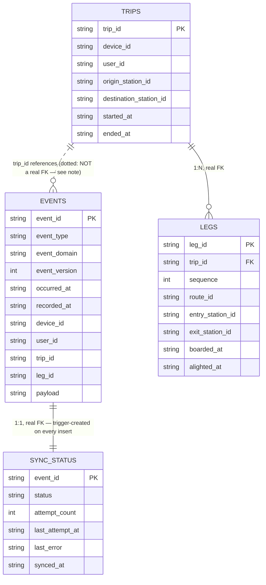
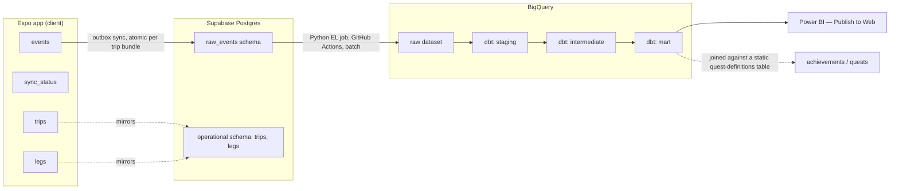

# SubwayQuest — Data Dictionary / ERD

Companion to `docs/data-layer/event-taxonomy.md` and `mobile/db/schema.sql`. This shows the shape of
the local SQLite layer and, at a lower level of detail, where it goes from there.

## Local SQLite schema



**Why the `EVENTS`↔`TRIPS` line is dotted, not solid:** every other relationship here is a real foreign
key — `legs.trip_id` can't point at a `trips` row that doesn't exist, and `sync_status.event_id` can't
point at an `events` row that doesn't exist. `events.trip_id` is different: `trips` is a *projection
built from* `events`, not the other way around. A `trip_started` event is what creates the concept of a
trip in the first place — there's no `trips` row to reference at the moment it's written. Enforcing a
real FK here would have it backwards. `trip_id` is still `NOT NULL`/constrained (see `schema.sql`'s
`CHECK`), just not a formal foreign key.

**No `EVENTS`↔`LEGS` line, for the same reason** — `leg_id` on `events` has the identical "references a
concept, not a row" relationship as `trip_id` does, just omitted from the diagram to avoid clutter.

**What's *not* in this diagram, deliberately:** no `device_to_user` mapping table (doesn't exist yet —
real auth hasn't shipped), no achievements/quests table (fully derived downstream, not part of this
schema at all — see "Full pipeline" below).

## Full pipeline (local → warehouse → dashboard)

Lower detail than the ERD above — this is the shape from PROJECT.md's architecture, not a re-derivation
of it, included so this doc is the one place that shows the whole path end to end.



`sync_status` doesn't appear past the device — it's purely local outbox bookkeeping, nothing about it
is ever synced (see taxonomy doc's "Envelope" section). Achievements/quests are shown as a dotted
downstream join, not a schema addition — confirmed earlier in this design pass to need no new event
types or tables, just a static quest-definitions table joined against the mart layer.

## Supabase RLS design

Every table in `operational` and `raw_events` enforces `auth.uid() = user_id` — real row-level
security, not just an organizational convention (see PROJECT.md's "Real auth from day one"). The one
real design question was **how `legs` gets checked**, since — like local SQLite — it only carries
`trip_id`, not its own `user_id` column.

**Considered: denormalizing `user_id` onto `legs`.** Would give every table an identical flat policy
(`auth.uid() = user_id`), no joins anywhere. Rejected — it's a second, write-only copy of a fact
`trips.user_id` already holds, kept in sync for no reason other than making its own policy simpler.

**Decided: derive it via a subquery against `trips`, written as a non-correlated `IN`, not a
correlated `EXISTS`.** The naive version of this —

```sql
using (exists (
  select 1 from operational.trips
  where trips.trip_id = legs.trip_id and trips.user_id = auth.uid()
))
```

— is a known Postgres/Supabase anti-pattern: it re-evaluates the subquery per row instead of once per
statement. The fix isn't to give up on deriving it, it's to write the derivation correctly:

```sql
using (
  trip_id in (select trip_id from operational.trips where user_id = auth.uid())
)
```

Same normalized data — nothing stored on `legs` beyond what it already has — but Postgres plans the
subquery once per statement rather than once per row, per Supabase's own RLS performance guidance for
this exact join-to-parent shape.

**`raw_events` needs the same pattern on `WITH CHECK`, not just `USING`.** `events.user_id` is
client-set at insert time; without a `WITH CHECK (auth.uid() = user_id)`, RLS would only ever be
restricting *reads*, leaving no actual enforcement stopping a client from writing rows under someone
else's `user_id`. This is the one place a policy gap would be a real cross-user data leak, not just an
inconsistency — worth flagging as the actual enforcement mechanism, not incidental hardening.

## Data-layer rigor checklist — final status

| # | item | status |
|---|---|---|
| 1 | Immutable, append-only event log | ✅ `events` |
| 2 | Client-generated idempotency keys | ✅ `event_id`, collision-safe UUIDs throughout |
| 3 | Documented event schema per event type | ✅ event-taxonomy.md |
| 4 | Real constraints at schema level | ✅ `mobile/db/schema_tests.py` — 29 checks, real file, re-runnable |
| 5 | Explicitly designed edge cases | ✅ documented in event-taxonomy.md |
| 6 | Sync policy, stated | ✅ idempotent-insert / single-writer, no real conflicts possible |
| 7 | dbt staging → intermediate → mart, with tests | ⬜ later phase — Supabase/BigQuery not wired up yet |
| 8 | CI on every change | ⬜ later phase |
| 9 | Data dictionary / ERD | ✅ this document |
| 10 | Deliberate scope exclusions, stated | ✅ ongoing section in event-taxonomy.md |

Everything achievable before Supabase/BigQuery exist is done. 7 and 8 are correctly blocked on work
that hasn't started yet, not gaps in this pass.
